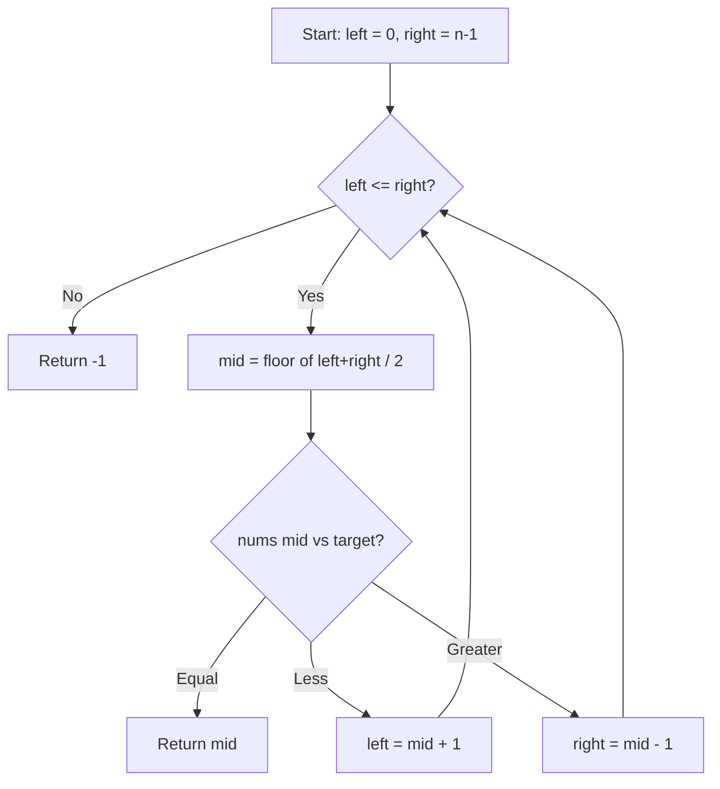

# LeetCode 704. Binary Search (Easy)

https://leetcode.com/problems/binary-search/

## U - Understand（問題の理解）

- **What**: Find target value in a sorted array
- **Input**: sorted array of integers (nums), target number
- **Output**: index of target, or -1 if not found

**Clarifying Questions:**
- "Let me clarify - the array is already sorted, correct?"
- "Are all elements unique, or could there be duplicates?"
- "Should I return any valid index if there are duplicates?"

**Constraints:**
- Array is sorted in ascending order
- All integers are unique
- Must achieve O(log n) runtime

**Test Cases:**

1. **Happy Path**: `[-1, 0, 3, 5, 9, 12]`, target = `9` → `4`
2. **Happy Path**: `[-1, 0, 3, 5, 9, 12]`, target = `2` → `-1` (not found)
3. **Edge Case**: `[5]`, target = `5` → `0` (single element, found)
4. **Edge Case**: `[5]`, target = `3` → `-1` (single element, not found)
5. **Constraint**: `[1, 2, 3, 4, 5]`, target = `1` → `0` (target at the beginning)
6. **Constraint**: `[1, 2, 3, 4, 5]`, target = `5` → `4` (target at the end)

## M - Match（パターンマッチ）

**Pattern: Binary Search**

"I think we can use binary search here."

Why this pattern?
- The array is sorted. That is the biggest hint.
- The problem says O(log n) runtime. Binary search gives O(log n).
- We can cut the search space in half each time by comparing the middle element with the target.

## P - Plan（プラン立て）

"Since the array is sorted and we need O(log n), I'll use binary search."

"I'll keep two pointers, left and right, for the search range."

"In each step, I:
1. Find the middle index
2. Compare nums[mid] with target
3. If equal, return mid
4. If nums[mid] < target, search the right half
5. If nums[mid] > target, search the left half"

"I keep going until left > right. Then the target is not found."

**Flowchart:**



**Pseudocode:**
```
// set left = 0, right = nums.length - 1
// while left <= right:
//   mid = floor((left + right) / 2)
//   if nums[mid] === target → return mid
//   if nums[mid] < target → left = mid + 1
//   if nums[mid] > target → right = mid - 1
// return -1 (not found)
```

## I - Implement（実装）

```typescript
function search(nums: number[], target: number): number {
    let left = 0;
    let right = nums.length - 1;

    while (left <= right) {
        // Avoid integer overflow: use left + (right - left) / 2
        // In JavaScript this isn't necessary, but good practice
        const mid = Math.floor((left + right) / 2);

        if (nums[mid] === target) {
            // Found the target
            return mid;
        } else if (nums[mid] < target) {
            // Target is in the right half
            left = mid + 1;
        } else {
            // Target is in the left half
            right = mid - 1;
        }
    }

    // Target not found
    return -1;
}
```

## R - Review（振り返り）

"Let me walk through Test Case 1: `[-1, 0, 3, 5, 9, 12]`, target = `9`."

| Step | left | right | mid | nums[mid] | Action | Result |
|------|------|-------|-----|-----------|--------|--------|
| 1 | 0 | 5 | 2 | 3 | 3 < 9 → go right | left = **3** |
| 2 | 3 | 5 | 4 | 9 | 9 === 9 → found! | return **4** |

"Let me also check the edge cases."

- **Single element, found** (`[5]`, target=5): left=0, right=0, mid=0. nums[0]=5 === 5 → return 0. Correct.
- **Single element, not found** (`[5]`, target=3): left=0, right=0, mid=0. nums[0]=5 > 3 → right = -1. Loop ends → return -1. Correct.
- **Target at beginning** (`[1,2,3,4,5]`, target=1): mid=2, nums[2]=3 > 1 → right=1. mid=0, nums[0]=1 === 1 → return 0. Correct.
- **Target at end** (`[1,2,3,4,5]`, target=5): mid=2, nums[2]=3 < 5 → left=3. mid=4, nums[4]=5 === 5 → return 4. Correct.

"I need to be careful with the boundary conditions. The condition should be `left <= right`, not `left < right`. When moving pointers, it's `mid + 1` and `mid - 1`, not just `mid`."

```typescript
console.log("Test 1:", search([-1, 0, 3, 5, 9, 12], 9));  // Expected: 4
console.log("Test 2:", search([-1, 0, 3, 5, 9, 12], 2));  // Expected: -1
console.log("Test 3:", search([5], 5));                   // Expected: 0 (single element, found)
console.log("Test 4:", search([5], 3));                   // Expected: -1 (single element, not found)
console.log("Test 5:", search([1, 2, 3, 4, 5], 1));       // Expected: 0 (target at beginning)
console.log("Test 6:", search([1, 2, 3, 4, 5], 5));       // Expected: 4 (target at end)
```

## E - Evaluate（評価）

**Time: O(log n)**
- "Time is O(log n) because we halve the search space each time."
- "So we need at most log2(n) steps."

**Space: O(1)**
- "Space is O(1) since we only use a few variables (left, right, mid)."

**Why this approach?**
- "sorted array" + "O(log n)" = binary search. There is no other choice.
- Iterative is simple and uses O(1) space.

**Trade-off:**
| | Iterative | Recursive |
|---|---|---|
| Time | O(log n) | O(log n) |
| Space | O(1) | O(log n) |
| Readability | Easy | A bit tricky |

→ "Iterative is better because of O(1) space."
