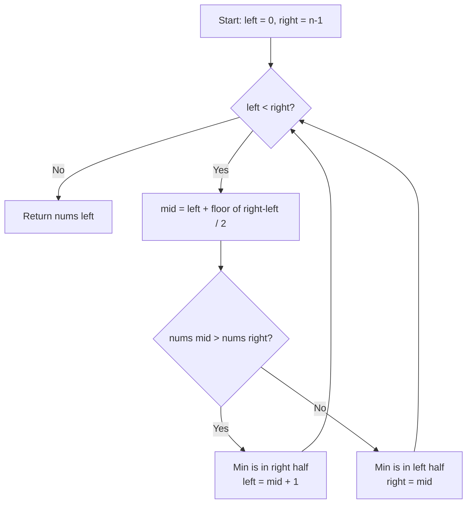

# LeetCode 153. Find Minimum in Rotated Sorted Array (Medium)

https://leetcode.com/problems/find-minimum-in-rotated-sorted-array/

## U - Understand（問題の理解）

- **What**: Find the minimum element in a sorted array that has been rotated
- **Input**: A sorted array `nums` rotated between 1 and n times, with all unique elements
- **Output**: The minimum element

**Clarifying Questions:**
- "Are all elements unique?" (Yes)
- "Can the array be not rotated at all — like still fully sorted?" (Yes, rotated n times = original)
- "What's the minimum array length?" (1)

**Constraints:**
- 1 <= n <= 5000
- -5000 <= nums[i] <= 5000
- All integers are unique
- Must run in O(log n) time

**Test Cases:**

1. **Happy Path**: `[3, 4, 5, 1, 2]` → `1` (rotated 3 times)
2. **Happy Path**: `[4, 5, 6, 7, 0, 1, 2]` → `0` (rotated 4 times)
3. **Edge Case**: `[1]` → `1` (single element)
4. **Edge Case**: `[2, 1]` → `1` (two elements, rotated)
5. **Edge Case**: `[1, 2]` → `1` (two elements, not rotated)
6. **Constraint**: `[11, 13, 15, 17]` → `11` (not rotated at all)
7. **Constraint**: `[-2, -1, 0, -5, -4, -3]` → `-5` (negative numbers)

## M - Match（パターンマッチ）

**Pattern: Binary Search (find transition point)**

"I think we can use binary search here."

Why this pattern?
- The problem says O(log n). That means binary search.
- A rotated sorted array has two sorted halves.
- The minimum is at the "rotation point" — where the array goes from big to small.
- We can compare `mid` with `right` to decide which half has the rotation point.

## P - Plan（プラン立て）

"Let me think about the steps."

"We have a sorted array that's been rotated. It looks like two sorted halves joined together. For example, `[4,5,6,7,0,1,2]` — the left half `[4,5,6,7]` is sorted and the right half `[0,1,2]` is sorted. The minimum is at the start of the right half."

"A brute force approach would scan every element — that's O(n). But since the array has a sorted structure, I can use binary search for O(log n)."

"The key idea: if `nums[mid] > nums[right]`, the minimum is in the right half. Otherwise, the minimum is in the left half including mid."

**Flowchart:**



**Pseudocode:**
```
// set left = 0, right = nums.length - 1
// while left < right:
//   mid = left + floor((right - left) / 2)
//   if nums[mid] > nums[right]:
//     minimum is in right half → left = mid + 1
//   else:
//     minimum is in left half (could be mid) → right = mid
// return nums[left]
```

## I - Implement（実装）

```typescript
function findMin(nums: number[]): number {
  let left = 0;
  let right = nums.length - 1;

  while (left < right) {
    const mid = left + Math.floor((right - left) / 2);

    if (nums[mid] > nums[right]) {
      // Minimum is in the right half (not including mid)
      left = mid + 1;
    } else {
      // Minimum is in the left half (could be mid itself)
      right = mid;
    }
  }

  return nums[left];
}
```

### Why compare with `nums[right]` and not `nums[left]`?

```typescript
// ✗ Comparing with nums[left] doesn't work:
// [3, 4, 5, 1, 2]  mid=5, left=3
// nums[mid] > nums[left] → true → go right
// But what about [1, 2, 3, 4, 5]?
// nums[mid] > nums[left] → true → go right (wrong!)

// ✓ Comparing with nums[right] works:
// [3, 4, 5, 1, 2]  mid=5, right=2
// nums[mid] > nums[right] → true → go right ✓
// [1, 2, 3, 4, 5]  mid=3, right=5
// nums[mid] > nums[right] → false → go left ✓
```

### Why `left < right` not `left <= right`?

This binary search narrows down to a **single element** (the minimum). When `left === right`, we've found it. If we used `left <= right`, we'd loop forever because we never skip `mid` when going left (`right = mid`, not `right = mid - 1`).

## R - Review（振り返り）

"Let me walk through Test Case 1: `[3, 4, 5, 1, 2]`."

```
配列を見てみよう:

5 |        *
4 |     *
3 |  *
2 |                 *
1 |              *
  +--+--+--+--+--+
     0  1  2  3  4

  左半分 [3,4,5] は昇順  右半分 [1,2] も昇順
  最小値は「ガクッと下がるところ」= index 3
```

Binary Search:

| Step | left | right | mid | nums[mid] | nums[right] | Action | Result |
|------|------|-------|-----|-----------|-------------|--------|--------|
| 1 | 0 | 4 | 2 | 5 | 2 | 5 > 2 → go right | left = **3** |
| 2 | 3 | 4 | 3 | 1 | 2 | 1 < 2 → go left | right = **3** |
| 3 | 3 | 3 | - | - | - | left === right → done | ans = nums[3] = **1** |

"Let me also try `[4, 5, 6, 7, 0, 1, 2]`."

```
7 |           *
6 |        *
5 |     *
4 |  *
3 |
2 |                       *
1 |                    *
0 |                 *
  +--+--+--+--+--+--+--+
     0  1  2  3  4  5  6
```

| Step | left | right | mid | nums[mid] | nums[right] | Action | Result |
|------|------|-------|-----|-----------|-------------|--------|--------|
| 1 | 0 | 6 | 3 | 7 | 2 | 7 > 2 → go right | left = **4** |
| 2 | 4 | 6 | 5 | 1 | 2 | 1 < 2 → go left | right = **5** |
| 3 | 4 | 5 | 4 | 0 | 1 | 0 < 1 → go left | right = **4** |
| 4 | 4 | 4 | - | - | - | left === right → done | ans = nums[4] = **0** |

"Let me check the not-rotated case: `[11, 13, 15, 17]`."

| Step | left | right | mid | nums[mid] | nums[right] | Action | Result |
|------|------|-------|-----|-----------|-------------|--------|--------|
| 1 | 0 | 3 | 1 | 13 | 17 | 13 < 17 → go left | right = **1** |
| 2 | 0 | 1 | 0 | 11 | 13 | 11 < 13 → go left | right = **0** |
| 3 | 0 | 0 | - | - | - | left === right → done | ans = nums[0] = **11** |

"Edge cases look good too."

- **Single element** (`[1]`): left=0, right=0 → loop skipped → return nums[0] = 1. Correct.
- **Two elements, rotated** (`[2, 1]`): mid=0, nums[0]=2 > nums[1]=1 → left=1. left=right=1 → return nums[1]=1. Correct.
- **Two elements, not rotated** (`[1, 2]`): mid=0, nums[0]=1 < nums[1]=2 → right=0. left=right=0 → return nums[0]=1. Correct.

```typescript
console.log(findMin([3, 4, 5, 1, 2]) === 1,           "Test 1: rotated 3 times");
console.log(findMin([4, 5, 6, 7, 0, 1, 2]) === 0,     "Test 2: rotated 4 times");
console.log(findMin([11, 13, 15, 17]) === 11,           "Test 3: not rotated");
console.log(findMin([1]) === 1,                          "Test 4: single element");
console.log(findMin([2, 1]) === 1,                       "Test 5: two elements rotated");
console.log(findMin([1, 2]) === 1,                       "Test 6: two elements sorted");
console.log(findMin([5, 1, 2, 3, 4]) === 1,             "Test 7: rotated once");
console.log(findMin([2, 3, 4, 5, 1]) === 1,             "Test 8: min at end");
console.log(findMin([-2, -1, 0, -5, -4, -3]) === -5,   "Test 9: negative numbers");
```

## E - Evaluate（評価）

**Time: O(log n)**
- "Time is O(log n) because each step cuts the search space in half. So we do at most log n comparisons."

**Space: O(1)**
- "Space is O(1). We only use two pointer variables and one mid variable."

**Why this approach?**
- The problem says O(log n) and the input has a sorted structure. Binary search is the right choice.
- Iterative is preferred over recursive. It uses O(1) space vs O(log n) for the call stack.

**Trade-off:**
| | Iterative | Recursive |
|---|---|---|
| Time | O(log n) | O(log n) |
| Space | O(1) | O(log n) |

→ "Iterative is better because of O(1) space."

## VARIATIONS

### A. What if duplicates are allowed?

That's **LeetCode 154: Find Minimum in Rotated Sorted Array II**. When `nums[mid] === nums[right]`, we can't decide which half to search. So we shrink by doing `right--`. Worst case becomes O(n).

```typescript
function findMinWithDuplicates(nums: number[]): number {
  let left = 0;
  let right = nums.length - 1;

  while (left < right) {
    const mid = left + Math.floor((right - left) / 2);

    if (nums[mid] > nums[right]) {
      left = mid + 1;
    } else if (nums[mid] < nums[right]) {
      right = mid;
    } else {
      // nums[mid] === nums[right], can't decide
      right--;
    }
  }

  return nums[left];
}
```

### B. Search in Rotated Sorted Array (LeetCode 33)

Instead of finding the minimum, search for a target value. Same idea: determine which half is sorted, then decide which half the target is in.

## WHEN TO USE WHICH

**Q: How do I know to use binary search?**
A: The problem says "O(log n)" and the input has a sorted structure. These are the two biggest hints.

**Q: Normal binary search vs this one — what's different?**
A: Normal binary search looks for a specific target. This one looks for a "transition point" — where the array stops being sorted. Instead of comparing `mid` with a target, we compare `mid` with `right` to determine which half has the rotation point.

**Q: Compare with right or left?**
A: Always compare with `right` for this problem. Comparing with `left` fails when the array is not rotated.

## COMMON INTERVIEW QUESTIONS

**Q: Why compare nums[mid] with nums[right] instead of nums[left]?**
A: "When the array is not rotated at all, like [1,2,3,4,5], comparing with nums[left] would tell us mid is always greater — we'd always go right and miss the minimum at index 0. Comparing with nums[right] correctly handles both rotated and non-rotated cases."

**Q: Why `right = mid` instead of `right = mid - 1`?**
A: "Because mid itself could be the minimum. If I skip it with mid - 1, I might miss the answer. For example, in [2, 1], mid=0, nums[0]=2 > nums[1]=1, so left = mid + 1 = 1, and we find 1. But in [1, 2], mid=0, nums[0]=1 < nums[1]=2, so right = mid = 0, and we find 1. If I did right = mid - 1, right would become -1 — wrong!"

**Q: Can you solve this with recursion?**
A: "Yes, but iterative is preferred. It uses O(1) space vs O(log n) call stack for recursion."

## RELATED PROBLEMS

- LeetCode 154: Find Minimum in Rotated Sorted Array II (Hard) — With duplicates
- LeetCode 33: Search in Rotated Sorted Array (Medium) — Search for a target
- LeetCode 81: Search in Rotated Sorted Array II (Medium) — Search with duplicates
- LeetCode 704: Binary Search (Easy) — Basic binary search
- LeetCode 162: Find Peak Element (Medium) — Similar "find transition point" pattern

## HOW TO READ CODE ALOUD

**Code Symbols:**
- `nums[mid]` → "nums at mid"
- `nums[mid] > nums[right]` → "nums at mid is greater than nums at right"
- `left + Math.floor((right - left) / 2)` → "left plus the floor of right minus left divided by two"
- `left = mid + 1` → "set left to mid plus one"
- `right = mid` → "set right to mid"

**Complexity:**
- O(log n) → "O of log n" or "logarithmic time"
- O(1) → "O of one" or "constant space"

**Example Explanation Script:**
"Let me trace through [3, 4, 5, 1, 2].
I set left to 0 and right to 4. Mid is 2, and nums[2] is 5.
I compare 5 with nums[right] which is 2. Since 5 is greater than 2, the minimum must be in the right half.
So I set left to mid plus 1, which is 3.
Now left is 3, right is 4. Mid is 3, nums[3] is 1.
I compare 1 with nums[right] which is 2. Since 1 is less than 2, the minimum could be mid itself.
So I set right to mid, which is 3.
Now left equals right — both are 3. The answer is nums[3] which is 1."
