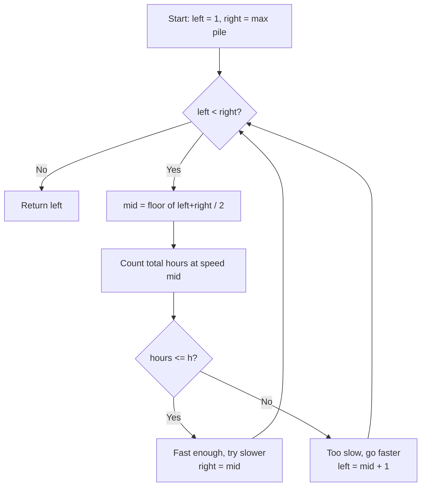

# LeetCode 875. Koko Eating Bananas (Medium)
https://leetcode.com/problems/koko-eating-bananas/

## U - Understand（問題の理解）

- **What**: Find the slowest eating speed to finish all bananas in time
- **Input**: piles (array of banana counts), h (hours we have)
- **Output**: smallest speed k (bananas per hour)

**Clarifying Questions:**
- "So she eats from only one pile per hour, right?"
- "If a pile is smaller than k, she just eats it and waits?"

**Constraints:**
- Each hour, Koko picks one pile and eats k bananas from it
- If a pile has less than k, she eats it all (still takes 1 hour)
- 1 <= piles.length <= 10^4, 1 <= piles[i] <= 10^9

**Test Cases:**

1. **Happy Path**: `piles = [3, 6, 7, 11], h = 8` → `4`
2. **Happy Path**: `piles = [30, 11, 23, 4, 20], h = 5` → `30`
3. **Edge Case**: `piles = [10], h = 10` → `1` (one pile, eat 1 per hour)
4. **Edge Case**: `piles = [1000000000], h = 2` → `500000000` (very big pile)
5. **Constraint**: `piles = [3, 6, 7, 11], h = 4` → `11` (piles == hours, must eat biggest pile in 1 hour)

## M - Match（パターンマッチ）

**Pattern: Binary Search on Answer**

"I think we can use binary search on the answer here."

Why this pattern?
- "find the smallest k" = we are searching for the best answer in a range.
- The speed k can be from 1 to max(piles). That's a big range.
- If speed k works, then k+1 also works. So the answer space is monotonic.
- We can binary search to find the smallest k that works.

## P - Plan（プラン立て）

"I need to find the smallest speed k. k can be from 1 to max(piles). That's a big range, so I'll use binary search."

"For each speed k, I check: can Koko finish in h hours? For each pile, she needs ceil(pile / k) hours. If total hours <= h, the speed is fast enough."

"I use binary search to find the smallest k that works."

**Flowchart:**



**Pseudocode:**
```
// set left = 1, right = max(piles)
// while left < right:
//   mid = floor((left + right) / 2)
//   count total hours at speed mid
//   if total hours <= h:
//     speed is enough, try slower → right = mid
//   else:
//     too slow, need faster → left = mid + 1
// return left
```

## I - Implement（実装）

```typescript
function minEatingSpeed(piles: number[], h: number): number {
    let left = 1;                       // slowest: 1 banana per hour
    let right = Math.max(...piles);     // fastest: biggest pile per hour

    while (left < right) {
        const mid = Math.floor((left + right) / 2);
        const hours = totalHours(piles, mid);

        if (hours <= h) {
            right = mid;      // speed is enough, try slower
        } else {
            left = mid + 1;   // too slow, need faster
        }
    }

    return left;
}

// How many hours does Koko need at speed k?
function totalHours(piles: number[], k: number): number {
    let hours = 0;
    for (const pile of piles) {
        hours += Math.ceil(pile / k);  // round up: 7 bananas at speed 4 = 2 hours
    }
    return hours;
}
```

## R - Review（振り返り）

"Let me walk through Test Case 1: `piles = [3, 6, 7, 11], h = 8`."

| Step | left | right | mid | Hours at mid | Action | Result |
|------|------|-------|-----|-------------|--------|--------|
| 1 | 1 | 11 | 6 | 6 | 6 <= 8 → try slower | right = **6** |
| 2 | 1 | 6 | 3 | 10 | 10 > 8 → too slow | left = **4** |
| 3 | 4 | 6 | 5 | 8 | 8 <= 8 → try slower | right = **5** |
| 4 | 4 | 5 | 4 | 8 | 8 <= 8 → try slower | right = **4** |
| - | 4 | 4 | - | - | left === right → done | ans = **4** |

"Let me also check the edge cases."

- **One pile** (`[10], h=10`): left=1, right=10. Binary search narrows down to k=1. At speed 1, total = ceil(10/1) = 10 hours = h. Correct.
- **Piles == hours** (`[3,6,7,11], h=4`): Must eat each pile in 1 hour. Needs speed = max pile = 11. Correct.

```typescript
console.log(minEatingSpeed([3, 6, 7, 11], 8));           // Expected: 4
console.log(minEatingSpeed([30, 11, 23, 4, 20], 5));     // Expected: 30
console.log(minEatingSpeed([30, 11, 23, 4, 20], 6));     // Expected: 23
console.log(minEatingSpeed([10], 10));                    // Expected: 1
console.log(minEatingSpeed([3, 6, 7, 11], 4));           // Expected: 11
```

## E - Evaluate（評価）

**Time: O(n * log m)**
- n = number of piles, m = max pile size
- "Time is O(n log m). Binary search runs log m times. Each time, I check all n piles."

**Space: O(1)**
- "Space is O(1). Just a few variables."

**Why this approach?**
- The answer space (1 to max pile) is monotonic: if speed k works, k+1 also works.
- Binary search on a monotonic space is the best way to find a boundary.
- Brute force would try every speed from 1 to max — that's O(m * n). Binary search makes it O(n * log m).

**Trade-off:**
| | Brute Force | Binary Search |
|---|---|---|
| Time | O(n * m) | O(n * log m) |
| Space | O(1) | O(1) |

→ "Binary search is much faster. For m = 10^9, log m is about 30. That's huge savings."

## VARIATIONS

この問題は「答えに対する二分探索 (Binary Search on Answer)」パターン。

同じパターンの問題:
- LeetCode 1011: Ship Packages in D Days → "find smallest ship size"
- LeetCode 410: Split Array Largest Sum → "find smallest max sum"
- LeetCode 69: Sqrt(x) → "find largest n where n*n <= x"

パターンの見分け方:
- "Find the minimum/maximum value that satisfies..."
- Big range of possible answers (1 to 10^9)
- Easy to check: "given this answer, does it work?"

## WHEN TO USE WHICH

Q: "How do I know this is binary search?"
A: "Two clues:
    1. I need the smallest/biggest value that works.
    2. If speed k works, then k+1 also works.
    So I can binary search on k."

Q: "How is this different from normal binary search?"
A: "Normal: search in an array for a target.
    This: search in a range of numbers (1 to max) for the best answer.
    But the idea is the same - cut in half each time."

## COMMON INTERVIEW QUESTIONS

Q: "Why use ceil(pile / k)?"
A: "If pile is 7 and speed is 4, she needs 2 hours.
    7 / 4 = 1.75, round up = 2. She can't eat half an hour."

Q: "Why is left=1, not left=0?"
A: "Speed 0 means she eats nothing. That doesn't make sense."

Q: "Why while (left < right), not left <= right?"
A: "I want to find a boundary, not an exact match.
    When left meets right, that's my answer."

## RELATED PROBLEMS
- LeetCode 704: Binary Search (basic)
- LeetCode 1011: Capacity To Ship Packages (same pattern)
- LeetCode 410: Split Array Largest Sum (same pattern)
- LeetCode 69: Sqrt(x) (binary search on answer)

## HOW TO READ CODE ALOUD

### コードの読み方
| Code | Say This |
|------|----------|
| `Math.max(...piles)` | "math dot max of piles" / "the biggest pile" |
| `Math.ceil(pile / k)` | "math dot ceil of pile divided by k" / "round up pile over k" |
| `hours <= h` | "hours is less than or equal to h" |
| `left < right` | "left is less than right" |

### 計算量の読み方
| Symbol | Say This |
|--------|----------|
| O(n * log m) | "O of n times log m" |

n = number of piles, m = biggest pile

### 例を説明するスクリプト
"Let me walk through an example.
 piles is three, six, seven, eleven. h is eight.

 The speed can be one to eleven.
 I try the middle, six.
 At speed six, I need one plus one plus two plus two, that's six hours.
 Six is less than eight, so six works.
 But maybe I can go slower. So I try the left half.

 I try three. That needs ten hours. Too slow.
 I try four. That needs eight hours. Just enough.
 Answer is four."
