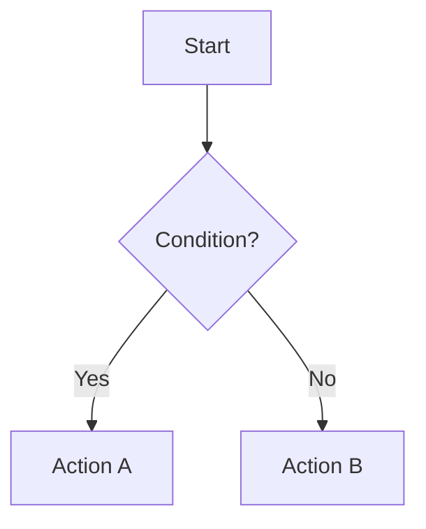

# LeetCode Learning Project

北米技術面接に向けたアルゴリズム学習リポジトリ。

## 英語のルール（最重要）

- **超簡単な英語だけ使う。** 難しい単語は覚えられないし、時間の無駄。
- 中学英語レベルで書く。"utilize" → "use"、"traverse" → "go through"、"subsequently" → "then"
- 短い文で書く。1文は15語以下を目指す。
- 面接フレーズも、丸暗記しやすいシンプルな文にする。

## 解説ファイル生成ルール

問題の解説ファイル（`*_solution.md`）を作成する際は、以下のセクション構成でMarkdownファイルとして作成すること。
コード部分は ```typescript コードブロックで記述する。

### UMPIREフレームワーク

解説ファイルはUMPIRE（Understand → Match → Plan → Implement → Review → Evaluate）に沿って構成する。
北米技術面接で評価されるのは「解けるかどうか」ではなく「問題解決のアプローチと思考プロセス」。
UMPIREの流れに沿うことで、解説を読む＝面接の思考プロセスをシミュレーションできるようにする。

各セクションでは面接官に話すフレーズを自然に含めること（例: "Let me clarify...", "I think we can use...", "Let me walk through this with an example..."）。

### 必須セクション（全問題共通）

```markdown
# LeetCode [番号]. [問題名] ([難易度: Easy/Medium/Hard])
[URL]

## U - Understand（問題の理解）
- What / Input / Output
- Clarifying Questions（面接官への質問例）
- Constraints
- 【必須】テストケースを最低2つ作る。以下の3観点を必ずカバー:
  1. **Happy Path**（正常系・典型的な入力）
  2. **Edge Case**（境界値・特殊な入力）
  3. **Constraint**（制約に関わるケース）
  ※ テストケースの作成が「理解」のゴール。面接官と認識をすり合わせる。

## M - Match（パターンマッチ）
- この問題に当てはまるパターン（例: Hash Map, Two Pointers）
- なぜそのパターンを選んだか

## P - Plan（プラン立て）
- 面接官に話すように思考プロセスを言語化
- Pseudocode（コメントで書く下書き）
  ※ 「プラン → Pseudocode → コード」の順。思考プロセスを口に出すのが最重要。

## I - Implement（実装）
- TypeScriptコード（```typescript コードブロック内）

## R - Review（振り返り）
- Uで作ったテストケースをline-by-lineで実行してデバッグ
  ※ コードを書いた後のReviewはテストケース作成に次いで最重要

## E - Evaluate（評価）
- Time / Space Complexity（理由付き）
- このアプローチを選んだ理由
- メリット・デメリット（他のアプローチとの比較があれば）
```

### 追加セクション（トピックに応じて）

```markdown
## VARIATIONS (バリエーション)
このアルゴリズムの派生パターン（例：Binary Searchなら Lower/Upper Bound）

## WHEN TO USE WHICH (使い分け)
Q&A形式でパターンの使い分けを説明

## COMMON INTERVIEW QUESTIONS
よくある質問と回答（Q&A形式）

## RELATED PROBLEMS
関連するLeetCode問題のリスト

## HOW TO READ CODE ALOUD (口頭での読み方)
コード・記号の英語での読み方
計算量の読み方（O(log n) → "O of log n"）
例を使った説明スクリプト
```

### 可視化ガイドライン

解説ファイルの図解には **Mermaid** と **Markdownテーブル** を使い分ける。MCP等の外部ツールは不要（GitHubが```mermaidを直接レンダリングする）。

#### P - Plan セクション

アルゴリズムに分岐ロジックがある場合は ```mermaid flowchart で図示する:

````markdown

````

**Mermaidを使う場面:**
- アルゴリズムの分岐ロジック（if/else/while の構造）
- ツリー・グラフの構造図
- 再帰の呼び出し順序

#### R - Review セクション

状態変化はMarkdownテーブルで整理する。1行に1操作。変化した値を **bold** でハイライト:

```markdown
| Step | i | Action | Stack | answer |
|------|---|--------|-------|--------|
| 1 | 0 | push 0 | `[0]` | [0,0,0] |
| 2 | 1 | pop 0, ans[0]=1 | `[]` | [**1**,0,0] |
```

**テーブルを使う場面（R - Review）:**
- 配列・ポインタの状態変化
- スタック・キューの操作
- Binary Searchの範囲縮小
- Linked Listの状態変化（テーブル＋補助ASCII art）

**ASCII artを残す場面:**
- 価格チャート・値の分布グラフ（視覚的に有効）
- Linked Listのポインタ付け替え図（矢印が直感的）
- 配列上のポインタ位置表示（L/R/mid等）

**ルール:**
- 1ステップに1操作だけ
- ステップ間に空行は不要（テーブルが区切りの役割を果たす）
- ハイライト記号を統一: 変化した値は **bold**、確認は ✓

### 参考例

`BinarySearch/BinarySearch_solution.md` を参照。

## Explanation Style Guidelines

When explaining code or algorithms (in conversation, not in solution files):

- **Visualize over verbalize**: Use ASCII diagrams and figures instead of long text. Show ranges, pointer movements, and comparisons visually.
- **Less is more**: Remove every sentence that doesn't add understanding. If a diagram already explains it, don't repeat it in words.
- **Concrete examples first**: Always start with a specific, small example (5-6 elements) before stating general rules. Never explain abstract logic without a concrete case.
- **Middle-school friendly**: Assume no programming background. Use real-world analogies (e.g., weight scale, people in a line) to build intuition before showing code.
- **One concept at a time**: Don't mix the main algorithm with edge-case handling. Explain the core idea first, then layer on details like duplicate skipping.
- **Show, don't tell "why"**: Instead of saying "this works because X", show two cases side by side — one that works and one that doesn't — so the reader sees why themselves.

## ファイル構成

テーマ別ディレクトリの中に問題ファイルと解説ファイルを配置する。

```
[テーマ名]/
├── [Problem1].ts              # 問題 - 自分で解く用
├── [Problem1]_solution.md     # 解説 - 学習・復習用（Markdown）
├── [Problem2].ts
└── [Problem2]_solution.md
```

例:
```
BinarySearch/
├── BinarySearch.ts
├── BinarySearch_solution.md
├── KokoEatingBananas.ts
└── KokoEatingBananas_solution.md
```
