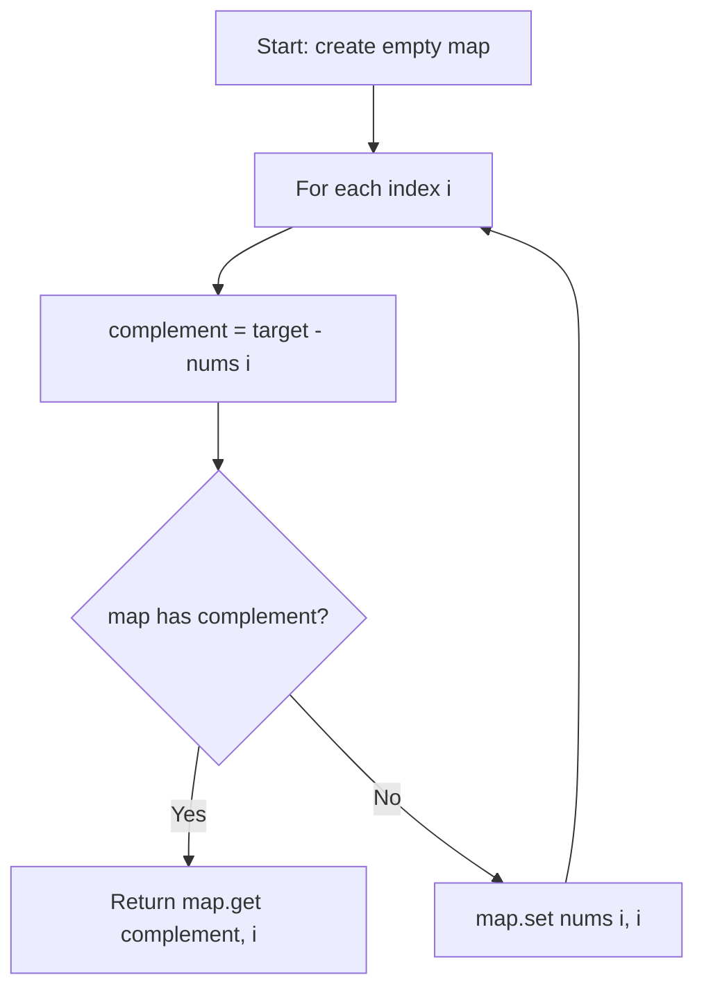

# LeetCode 1. Two Sum (Easy)

https://leetcode.com/problems/two-sum/

## U - Understand（問題の理解）

- **What**: Find two numbers in an array that add up to a target. Return their indices.
- **Input**: An integer array `nums` and an integer `target`
- **Output**: Indices of the two numbers as `[index1, index2]` (0-indexed, any order)

**Clarifying Questions:**
- "Can I assume there is exactly one solution?"
- "Can the array contain negative numbers?"
- "Are the indices 0-based?"
- "Can I return the indices in any order?"

**Constraints:**
- 2 <= nums.length <= 10^4
- -10^9 <= nums[i] <= 10^9
- Exactly one solution exists
- Cannot use the same element twice

**Test Cases:**

1. **Happy Path**: `nums = [2, 7, 11, 15], target = 9` → `[0, 1]` (2 + 7 = 9)
2. **Edge Case**: `nums = [3, 3], target = 6` → `[0, 1]` (duplicate values)
3. **Edge Case**: `nums = [-1, -2, -3, -4, -5], target = -8` → `[2, 4]` (negative numbers)
4. **Constraint**: `nums = [1, 2, 3, 4], target = 7` → `[2, 3]` (answer at the end)

## M - Match（パターンマッチ）

**Pattern: Hash Map (complement lookup)**

"I think we can use a hash map to speed this up."

Why this pattern?
- Brute force checks every pair. That is O(n squared).
- For each number, we need to find `target - num` (the complement).
- A hash map lets us check if the complement exists in O(1).
- So we trade space for time: O(n) space to get O(n) time.

## P - Plan（プラン立て）

"Let me think about the steps."

"I go through the array once. For each number, I compute the complement — that is `target - nums[i]`. If the complement is already in the map, I found my pair. If not, I store the current number and its index in the map."

"By checking the map before inserting, I make sure I don't use the same element twice."

**Pseudocode:**
```
// create empty map
// for each index i:
//   complement = target - nums[i]
//   if map has complement → return [map.get(complement), i]
//   else → map.set(nums[i], i)
// return [] (should never reach here)
```

**Flowchart:**



## I - Implement（実装）

```typescript
function twoSum(nums: number[], target: number): number[] {
    const map = new Map<number, number>();
    for (let i = 0; i < nums.length; i++) {
        const complement = target - nums[i];
        if (map.has(complement)) {
            return [map.get(complement)!, i];
        }
        map.set(nums[i], i);
    }
    return [];
}
```

## R - Review（振り返り）

"Let me walk through Test Case 1: `nums = [2, 7, 11, 15], target = 9`."

| Step | i | nums[i] | complement | map has it? | Action | map |
|------|---|---------|------------|-------------|--------|-----|
| 1 | 0 | 2 | 7 | No | store {2:0} | {2:0} |
| 2 | 1 | 7 | 2 | **Yes** | return [**0, 1**] ✓ | |

"Let me also check Test Case 2: `nums = [3, 2, 4], target = 6`."

| Step | i | nums[i] | complement | map has it? | Action | map |
|------|---|---------|------------|-------------|--------|-----|
| 1 | 0 | 3 | 3 | No | store {3:0} | {3:0} |
| 2 | 1 | 2 | 4 | No | store {2:1} | {3:0, 2:1} |
| 3 | 2 | 4 | 2 | **Yes** | return [**1, 2**] ✓ | |

"Let me check the edge case: `nums = [3, 3], target = 6`."

| Step | i | nums[i] | complement | map has it? | Action | map |
|------|---|---------|------------|-------------|--------|-----|
| 1 | 0 | 3 | 3 | No | store {3:0} | {3:0} |
| 2 | 1 | 3 | 3 | **Yes** | return [**0, 1**] ✓ | |

"This works because we check the map before inserting. So the second 3 finds the first 3 in the map."

```typescript
console.log("Test 1:", twoSum([2, 7, 11, 15], 9));
// Expected: [0, 1]

console.log("Test 2:", twoSum([3, 2, 4], 6));
// Expected: [1, 2]

console.log("Test 3:", twoSum([3, 3], 6));
// Expected: [0, 1]

console.log("Test 4:", twoSum([-1, -2, -3, -4, -5], -8));
// Expected: [2, 4]

console.log("Test 5:", twoSum([1, 2, 3, 4], 7));
// Expected: [2, 3]
```

## E - Evaluate（評価）

**Time: O(n)**
- "I go through the array once. Each map lookup and insert is O(1). So total is O(n)."

**Space: O(n)**
- "In the worst case, I store all n elements in the map before finding the answer."

**Why this approach?**
- Hash map gives O(n) time, which is much better than brute force O(n squared).
- The trade-off is O(n) extra space for the map.

**Brute Force vs Hash Map:**

```
Brute Force:               Hash Map:
for i in 0..n:             for i in 0..n:
  for j in i+1..n:           complement = target - nums[i]
    if nums[i]+nums[j]==t     if map.has(complement) → found!
                              map.set(nums[i], i)

Time:  O(n²)               Time:  O(n)
Space: O(1)                 Space: O(n)
```

"The hash map approach trades space for time. Instead of checking every pair, we remember what we've seen so we can find the complement in O(1)."

## TWO SUM vs TWO SUM II

| | Two Sum (LC 1) | Two Sum II (LC 167) |
|---|---|---|
| **Input** | Unsorted array | Sorted array |
| **Output** | 0-indexed | 1-indexed |
| **Approach** | Hash map | Two pointers |
| **Time** | O(n) | O(n) |
| **Space** | O(n) | O(1) |

- **Unsorted → Hash map**: Can't use pointer direction because values aren't ordered
- **Sorted → Two pointers**: Can remove candidates by direction, no extra space needed

"If the interviewer asks 'Can you solve this without extra space?', the answer is: only if you can sort the array first. But sorting loses the original indices, which this problem needs."

## COMMON INTERVIEW QUESTIONS

**Q: Why not sort the array and use two pointers?**
A: "Sorting changes the indices. This problem asks for the original indices, so we'd need to track them separately. A hash map is simpler and also O(n)."

**Q: Why do you check the map before inserting?**
A: "This makes sure we don't use the same element twice. By checking first, we only match with elements we already saw."

**Q: What if there are duplicate values?**
A: "The map stores the most recent index for each value. Since we check before inserting, duplicates like [3, 3] with target 6 work correctly — when we reach the second 3, the first 3 is already in the map."

## RELATED PROBLEMS

- LeetCode 167. Two Sum II (sorted array, two pointers)
- LeetCode 15. 3Sum (fix one + Two Sum)
- LeetCode 170. Two Sum III - Data Structure Design
- LeetCode 560. Subarray Sum Equals K (hash map for prefix sums)
