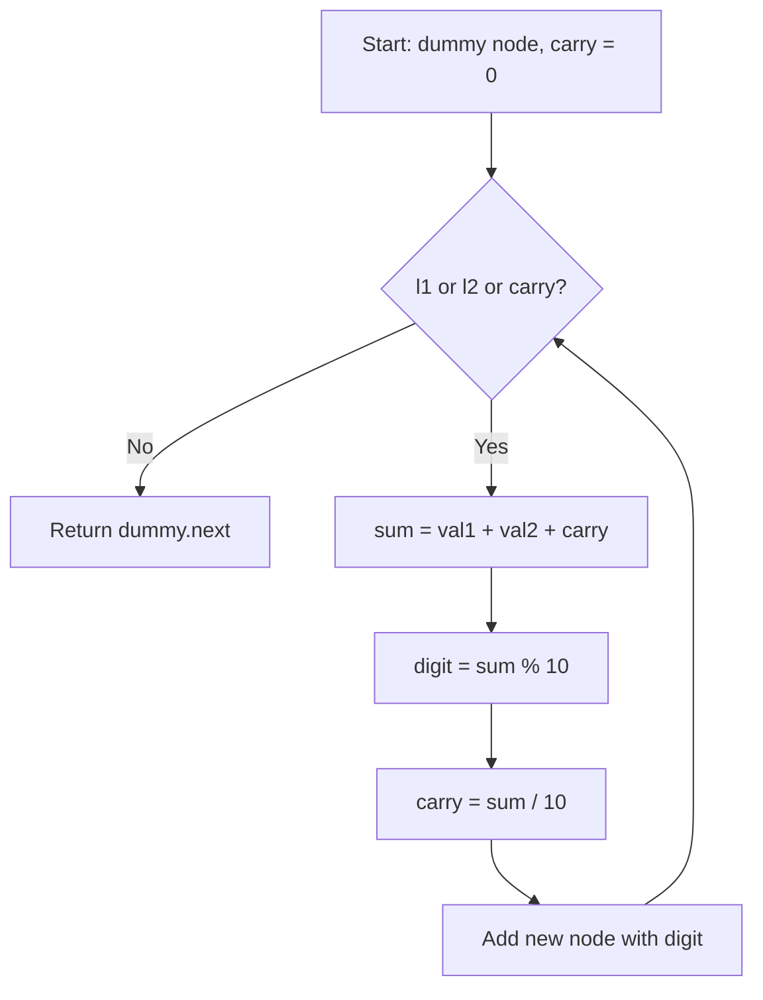

# LeetCode 2. Add Two Numbers (Medium)

https://leetcode.com/problems/add-two-numbers/

## U - Understand（問題の理解）

- **What**: Add two numbers that are stored as linked lists
- **Input**: Two non-empty linked lists (digits in reverse order)
- **Output**: A linked list of the sum (also in reverse order)

**Key insight**: The digits are already in reverse order. So the head is the ones digit. This makes addition easy — we just go left to right, like how we add by hand.

```
  l1: 2 -> 4 -> 3        (represents 342)
  l2: 5 -> 6 -> 4        (represents 465)
                           342 + 465 = 807
  out: 7 -> 0 -> 8       (represents 807)
```

**Clarifying Questions:**
- "Let me clarify — the digits are in reverse order, right? So [2,4,3] means 342?"
- "Can the two lists have different lengths?" → Yes.
- "Can the result be longer than both inputs?" → Yes, for example 99 + 1 = 100.
- "Are there leading zeros?" → No, except the number 0 itself.

**Constraints:**
- Each list has 1 to 100 nodes
- Each node value is 0 to 9
- No leading zeros

**Test Cases:**

1. **Happy Path**: `[2,4,3]` + `[5,6,4]` → `[7,0,8]` (342 + 465 = 807)
2. **Edge Case**: `[0]` + `[0]` → `[0]` (0 + 0 = 0)
3. **Edge Case (different lengths)**: `[9,9]` + `[1]` → `[0,0,1]` (99 + 1 = 100)
4. **Constraint (carry at the end)**: `[9,9,9,9,9,9,9]` + `[9,9,9,9]` → `[8,9,9,9,0,0,0,1]`

## M - Match（パターンマッチ）

**Pattern: Linked List traversal with carry**

"I think this is like adding numbers by hand, column by column."

Why this pattern?
- We go through both lists at the same time, digit by digit.
- We add two digits + carry, just like pen-and-paper math.
- Reverse order makes it easy — we start from the ones digit (the head).

This is similar to "Merge Two Sorted Lists" — we go through two lists at the same time and build a new list.

## P - Plan（プラン立て）

"Let me think about the steps."

"I'll go through both lists from head to tail. At each step, I add two digits plus the carry. I keep the ones digit and carry the tens digit."

"This is like how we add numbers by hand:"

```
    3 4 2
+   4 6 5
---------
    8 0 7     (carry happens at the tens place: 4+6=10)
```

"For the linked list, I:
1. Make a dummy head (makes it easy to build the result list)
2. Go through both lists at the same time
3. At each step: sum = digit1 + digit2 + carry
4. New digit = sum % 10, new carry = Math.floor(sum / 10)
5. Make a new node with the digit, add it to the result
6. After the loop, if carry > 0, add one more node"

**Flowchart:**



**Pseudocode:**
```
// make a dummy head node
// set carry = 0, curr = dummy
// while l1 or l2 or carry > 0:
//   val1 = l1 ? l1.val : 0
//   val2 = l2 ? l2.val : 0
//   sum = val1 + val2 + carry
//   carry = Math.floor(sum / 10)
//   digit = sum % 10
//   curr.next = new ListNode(digit)
//   curr = curr.next
//   if l1: l1 = l1.next
//   if l2: l2 = l2.next
// return dummy.next
```

## I - Implement（実装）

```typescript
function addTwoNumbers(l1: ListNode | null, l2: ListNode | null): ListNode | null {
    const dummy = new ListNode(0);
    let curr = dummy;
    let carry = 0;

    while (l1 !== null || l2 !== null || carry > 0) {
        const val1 = l1 ? l1.val : 0;
        const val2 = l2 ? l2.val : 0;
        const sum = val1 + val2 + carry;

        carry = Math.floor(sum / 10);
        curr.next = new ListNode(sum % 10);
        curr = curr.next;

        if (l1) l1 = l1.next;
        if (l2) l2 = l2.next;
    }

    return dummy.next;
}
```

## R - Review（振り返り）

"Let me walk through Test Case 1: `[2,4,3]` + `[5,6,4]`."

| Step | l1.val | l2.val | carry | sum | digit (sum%10) | carry (sum/10) | Result so far |
|------|--------|--------|-------|-----|----------------|----------------|---------------|
| 1 | 2 | 5 | 0 | 7 | **7** | 0 | 7 |
| 2 | 4 | 6 | 0 | 10 | **0** | **1** | 7→0 |
| 3 | 3 | 4 | 1 | 8 | **8** | 0 | 7→0→8 |

Loop ends (l1=null, l2=null, carry=0). Return `7 -> 0 -> 8` ✓

"Let me check Test Case 3: `[9,9]` + `[1]` (99 + 1 = 100)."

| Step | l1.val | l2.val | carry | sum | digit | carry | Result so far |
|------|--------|--------|-------|-----|-------|-------|---------------|
| 1 | 9 | 1 | 0 | 10 | **0** | **1** | 0 |
| 2 | 9 | 0 | 1 | 10 | **0** | **1** | 0→0 |
| 3 | 0 | 0 | 1 | 1 | **1** | 0 | 0→0→1 |

Loop ends. Return `0 -> 0 -> 1` (= 100) ✓

"Let me also check edge cases."

- **Both zero** (`[0]` + `[0]`): sum=0, digit=0, carry=0. Return `0` ✓
- **Carry at the very end** (`[9,9,9,9,9,9,9]` + `[9,9,9,9]`): After all 7 steps, carry=1, so we add one more node. Result is `[8,9,9,9,0,0,0,1]` ✓

"The `carry > 0` in the while condition handles the case where the result is longer than both inputs."

```typescript
// Helper: make a linked list from array
function makeList(arr: number[]): ListNode | null {
    if (arr.length === 0) return null;
    const head = new ListNode(arr[0]);
    let curr = head;
    for (let i = 1; i < arr.length; i++) {
        curr.next = new ListNode(arr[i]);
        curr = curr.next;
    }
    return head;
}

// Helper: linked list to array
function toArray(head: ListNode | null): number[] {
    const result: number[] = [];
    while (head) {
        result.push(head.val);
        head = head.next;
    }
    return result;
}

console.log("Test 1:", toArray(addTwoNumbers(makeList([2,4,3]), makeList([5,6,4]))));     // [7,0,8]
console.log("Test 2:", toArray(addTwoNumbers(makeList([0]), makeList([0]))));               // [0]
console.log("Test 3:", toArray(addTwoNumbers(makeList([9,9]), makeList([1]))));             // [0,0,1]
console.log("Test 4:", toArray(addTwoNumbers(makeList([9,9,9,9,9,9,9]), makeList([9,9,9,9]))));  // [8,9,9,9,0,0,0,1]
```

## E - Evaluate（評価）

**Time: O(max(m, n))**
- "m and n are the lengths of the two lists."
- "I go through both lists once. The loop runs max(m, n) times, plus one more if there's a final carry."

**Space: O(max(m, n))**
- "The result list has at most max(m, n) + 1 nodes."
- "I don't use any extra space besides the result."

**Why this approach?**
- This is the natural way — just like adding by hand.
- The reverse order is already given, so no need to reverse first.
- The dummy node trick makes the code clean. Without it, I'd need a special case for the first node.

## COMMON INTERVIEW QUESTIONS

**Q: Why use a dummy node?**
A: "Without a dummy node, I need special handling for the first node. The dummy node lets me always do `curr.next = new ListNode(...)` without checking if the result list is empty."

**Q: What if the lists have different lengths?**
A: "I use 0 for the shorter list's missing digits. For example, `[9,9]` + `[1]` — when l2 runs out, I treat its value as 0."

**Q: Why check `carry > 0` in the while condition?**
A: "If both lists are done but carry is still 1, I need one more node. For example, `[5]` + `[5]` = `[0,1]` (5 + 5 = 10)."

**Q: What if digits were in normal order (not reversed)?**
A: "Then I'd reverse both lists first, add them, and reverse the result. Or use a stack."

## HOW TO READ CODE ALOUD

```
const dummy = new ListNode(0)   → "Make a dummy node with value 0"
let carry = 0                   → "Let carry equal 0"
while (l1 || l2 || carry > 0)  → "While l1 or l2 is not null, or carry is greater than 0"
const val1 = l1 ? l1.val : 0   → "If l1 exists, val1 is l1 dot val. Otherwise, val1 is 0"
sum % 10                        → "sum mod 10" or "the remainder of sum divided by 10"
Math.floor(sum / 10)            → "floor of sum divided by 10"
curr.next = new ListNode(...)   → "Set curr dot next to a new list node"
return dummy.next               → "Return dummy dot next"
```

## RELATED PROBLEMS

- [206. Reverse Linked List](https://leetcode.com/problems/reverse-linked-list/) - Basic linked list manipulation
- [21. Merge Two Sorted Lists](https://leetcode.com/problems/merge-two-sorted-lists/) - Similar two-list traversal pattern
- [445. Add Two Numbers II](https://leetcode.com/problems/add-two-numbers-ii/) - Same problem, but digits are in normal order (need stack or reverse)
- [67. Add Binary](https://leetcode.com/problems/add-binary/) - Same carry logic, but with strings
- [66. Plus One](https://leetcode.com/problems/plus-one/) - Simple carry propagation in an array
