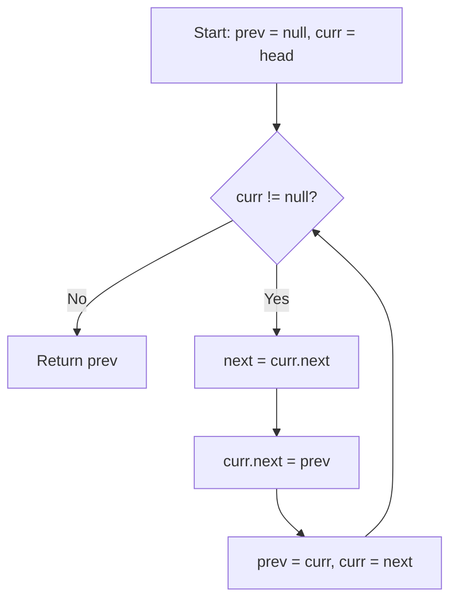

# LeetCode 206. Reverse Linked List (Easy)

https://leetcode.com/problems/reverse-linked-list/

## U - Understand（問題の理解）

- **What**: Reverse a singly linked list
- **Input**: head of a linked list
- **Output**: head of the reversed list

**Clarifying Questions:**
- "Can the list be empty?" → Yes, 0 nodes is possible.
- "Should I reverse it in-place, or can I make a new list?" → In-place is better.

**Constraints:**
- 0 to 5000 nodes
- Node values: -5000 to 5000

**Test Cases:**

1. **Happy Path**: `[1, 2, 3, 4, 5]` → `[5, 4, 3, 2, 1]`
2. **Edge Case**: `[]` → `[]` (empty list)
3. **Edge Case**: `[1]` → `[1]` (single node, no change)
4. **Constraint**: `[1, 2]` → `[2, 1]` (smallest list that actually changes)

## M - Match（パターンマッチ）

**Pattern: Iterative pointer manipulation**

"I think we can use three pointers: `prev`, `curr`, and `next`."

Why this pattern?
- We need to change the direction of each arrow.
- Each node should point to its previous node, not the next one.
- Three pointers let us flip one arrow at a time without losing the rest of the list.

## P - Plan（プラン立て）

"Let me think about the steps."

"I go through the list and flip each arrow one by one."

"For each node, I:
1. Save the next node (so I don't lose it)
2. Point the current node to prev (flip the arrow)
3. Move prev and curr forward"

"When curr is null, prev is the new head."

**Pseudocode:**
```
// set prev = null, curr = head
// while curr is not null:
//   save next = curr.next
//   flip: curr.next = prev
//   move: prev = curr
//   move: curr = next
// return prev (new head)
```

**Flowchart:**



## I - Implement（実装）

```typescript
function reverseList(head: ListNode | null): ListNode | null {
    let prev: ListNode | null = null;
    let curr: ListNode | null = head;

    while (curr !== null) {
        const next = curr.next; // save next
        curr.next = prev;       // flip the arrow
        prev = curr;            // move prev forward
        curr = next;            // move curr forward
    }

    return prev;
}
```

## R - Review（振り返り）

"Let me walk through this with Test Case 1: `[1, 2, 3, 4, 5]`."

**Summary table:**

| Step | curr | next = curr.next | Flip: curr.next = | prev → | curr → |
|------|------|-----------------|-------------------|--------|--------|
| 1 | 1 | 2 | null | **1** | **2** |
| 2 | 2 | 3 | 1 | **2** | **3** |
| 3 | 3 | 4 | 2 | **3** | **4** |
| 4 | 4 | 5 | 3 | **4** | **5** |
| 5 | 5 | null | 4 | **5** | **null** |

Done! curr is null → return prev (node **5**)

**Key steps visualized:**

```
Step 1: Flip node 1
  null <- 1    2 -> 3 -> 4 -> 5 -> null
         prev  curr

Step 3: Flip node 3
  null <- 1 <- 2 <- 3    4 -> 5 -> null
                    prev  curr

Step 5: Done!
  null <- 1 <- 2 <- 3 <- 4 <- 5
                              prev  curr = null
```

"Let me also check Edge Cases."

- **Empty list** (`[]`): curr starts as null → skip while loop → return prev (null) ✓
- **Single node** (`[1]`): next = null, flip 1.next = null, prev = 1, curr = null → return 1 ✓

```typescript
// Helper: make a linked list from array
function makeList(arr: number[]): ListNode | null {
    if (arr.length === 0) return null;
    const head = new ListNode(arr[0]);
    let curr = head;
    for (let i = 1; i < arr.length; i++) {
        curr.next = new ListNode(arr[i]);
        curr = curr.next;
    }
    return head;
}

// Helper: linked list to array
function toArray(head: ListNode | null): number[] {
    const result: number[] = [];
    while (head) {
        result.push(head.val);
        head = head.next;
    }
    return result;
}

console.log("Test 1:", toArray(reverseList(makeList([1,2,3,4,5]))));  // [5,4,3,2,1]
console.log("Test 2:", toArray(reverseList(makeList([1,2]))));         // [2,1]
console.log("Test 3:", toArray(reverseList(makeList([]))));            // []
console.log("Test 4:", toArray(reverseList(makeList([1]))));           // [1]
```

## E - Evaluate（評価）

**Time: O(n)**
- "I visit each node once. n is the number of nodes."

**Space: O(1)**
- "I only use three pointers: prev, curr, next. No extra data structures."

**Why this approach?**
- Iterative is simple and uses O(1) space.
- Recursive approach also works, but uses O(n) space for the call stack.

**Trade-off:**
| | Iterative | Recursive |
|---|---|---|
| Time | O(n) | O(n) |
| Space | O(1) | O(n) |
| Readability | Easy | A bit tricky |

→ "Iterative is better for this problem because of O(1) space."

## VARIATIONS

### Recursive approach

```typescript
function reverseListRecursive(head: ListNode | null): ListNode | null {
    // Base case: empty or single node
    if (head === null || head.next === null) return head;

    // Reverse the rest of the list
    const newHead = reverseListRecursive(head.next);

    // Flip the arrow
    head.next.next = head;
    head.next = null;

    return newHead;
}
```

- Time: O(n), Space: O(n) - because of the call stack

### Reverse part of a list (LeetCode 92)

- Reverse only from position `left` to `right`.
- Same idea, but you need to track the node before `left`.

## COMMON INTERVIEW QUESTIONS

**Q: Why do you need the `next` variable?**
A: "If I flip `curr.next` to `prev` first, I lose the link to the rest of the list. So I save it in `next` first."

**Q: Why is `prev` initialized to null?**
A: "The first node becomes the last node after reverse. The last node should point to null. So `prev` starts as null."

**Q: Iterative or recursive - which is better?**
A: "Iterative is better for this problem. It uses O(1) space. Recursive uses O(n) space for the call stack."

## HOW TO READ CODE ALOUD

```
let prev = null          → "Let prev equal null"
let curr = head          → "Let curr equal head"
while (curr !== null)    → "While curr is not null"
const next = curr.next   → "Const next equals curr dot next"
curr.next = prev         → "Set curr dot next to prev"
prev = curr              → "Move prev to curr"
curr = next              → "Move curr to next"
return prev              → "Return prev"
```

**Reading complexity:**
- O(n) → "O of n"
- O(1) → "O of one" or "constant space"

## RELATED PROBLEMS

- [92. Reverse Linked List II](https://leetcode.com/problems/reverse-linked-list-ii/) - Reverse part of a list
- [234. Palindrome Linked List](https://leetcode.com/problems/palindrome-linked-list/) - Uses reverse to check palindrome
- [25. Reverse Nodes in k-Group](https://leetcode.com/problems/reverse-nodes-in-k-group/) - Reverse in groups (Hard)
- [21. Merge Two Sorted Lists](https://leetcode.com/problems/merge-two-sorted-lists/) - Another basic linked list problem
