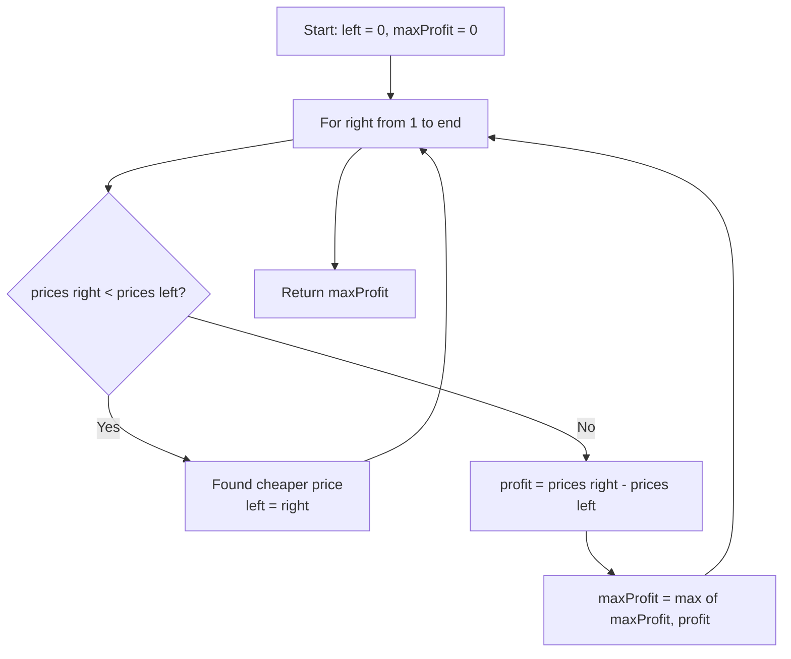

# LeetCode 121. Best Time to Buy and Sell Stock (Easy)

https://leetcode.com/problems/best-time-to-buy-and-sell-stock/

## U - Understand（問題の理解）

- **What**: Find the maximum profit from buying and selling a stock once
- **Input**: An array `prices` where `prices[i]` is the stock price on day `i`
- **Output**: The maximum profit (or `0` if no profit is possible)

**Clarifying Questions:**
- "Can I buy and sell on the same day?" (No — sell must be after buy)
- "Is there always a profit possible?" (No — return 0 if prices only go down)
- "Can I make multiple transactions?" (No — just one buy and one sell)

**Constraints:**
- 1 <= prices.length <= 10^5
- 0 <= prices[i] <= 10^4

**Test Cases:**

1. **Happy Path**: `[7, 1, 5, 3, 6, 4]` → `5` (buy at 1, sell at 6)
2. **Edge Case**: `[7, 6, 4, 3, 1]` → `0` (always going down, no profit)
3. **Edge Case**: `[5]` → `0` (only one day, can't sell)
4. **Constraint**: `[1, 2, 3, 4, 5]` → `4` (always going up, buy first sell last)

## M - Match（パターンマッチ）

**Pattern: Sliding Window (two pointers)**

"I think we can use a sliding window with two pointers."

Why this pattern?
- We need to find the biggest difference `prices[j] - prices[i]` where `j > i`.
- The left pointer is the buy day. The right pointer is the sell day.
- Both pointers only move forward — this is a sliding window.
- When we find a cheaper price, we move the buy day there.

## P - Plan（プラン立て）

"Let me think about the steps."

"I use left as the buy day and right as the sell day. I scan from left to right."

"For each right:
1. If prices[right] < prices[left], I found a cheaper buy price. Move left to right.
2. Otherwise, compute profit and update the max."

"When right reaches the end, I return maxProfit."

**Flowchart:**



**Pseudocode:**
```
// set left = 0, maxProfit = 0
// for right from 1 to end:
//   if prices[right] < prices[left]:
//     left = right (found cheaper buy price)
//   else:
//     profit = prices[right] - prices[left]
//     maxProfit = max(maxProfit, profit)
// return maxProfit
```

## I - Implement（実装）

```typescript
function maxProfit(prices: number[]): number {
  let left = 0; // buy day
  let maxProfit = 0;

  for (let right = 1; right < prices.length; right++) {
    if (prices[right] < prices[left]) {
      // Found a cheaper buy price
      left = right;
    } else {
      const profit = prices[right] - prices[left];
      maxProfit = Math.max(maxProfit, profit);
    }
  }

  return maxProfit;
}
```

### Why is this a Sliding Window?

- `left` (buy day) only moves **forward** — never backward
- `right` (sell day) moves forward one step each loop
- The "window" between `left` and `right` is the range we consider
- When we find a cheaper price, we **shrink** the window by moving `left` to `right`

### Alternative: Track Min Price Directly

```typescript
function maxProfitMinTrack(prices: number[]): number {
  let minPrice = Infinity;
  let maxProfit = 0;

  for (const price of prices) {
    minPrice = Math.min(minPrice, price);
    maxProfit = Math.max(maxProfit, price - minPrice);
  }

  return maxProfit;
}
```

Same idea, just written differently. Both are O(n) time, O(1) space.

## R - Review（振り返り）

"Let me walk through Test Case 1: `prices = [7, 1, 5, 3, 6, 4]`."

```
Price chart:

7 |  *
6 |              *
5 |        *
4 |                    *
3 |           *
2 |
1 |     *
  +--+--+--+--+--+--+--
     0  1  2  3  4  5
```

| Step | left | right | prices[L] | prices[R] | Action | maxProfit |
|------|------|-------|-----------|-----------|--------|-----------|
| 1 | 0 | 1 | 7 | 1 | 1 < 7 → move left | 0 |
| 2 | 1 | 2 | 1 | 5 | profit = 4 | **4** |
| 3 | 1 | 3 | 1 | 3 | profit = 2 | 4 |
| 4 | 1 | 4 | 1 | 6 | profit = 5 | **5** |
| 5 | 1 | 5 | 1 | 4 | profit = 3 | 5 |

**Answer: 5** (buy at day 1, sell at day 4) ✓

"Let me also check the edge case: `prices = [7, 6, 4, 3, 1]`."

```
Price chart (always going down):

7 |  *
6 |     *
5 |
4 |        *
3 |           *
2 |
1 |              *
  +--+--+--+--+--+--
     0  1  2  3  4
```

| Step | left | right | prices[L] | prices[R] | Action | maxProfit |
|------|------|-------|-----------|-----------|--------|-----------|
| 1 | 0 | 1 | 7 | 6 | 6 < 7 → move left | 0 |
| 2 | 1 | 2 | 6 | 4 | 4 < 6 → move left | 0 |
| 3 | 2 | 3 | 4 | 3 | 3 < 4 → move left | 0 |
| 4 | 3 | 4 | 3 | 1 | 1 < 3 → move left | 0 |

**Answer: 0** (no profit -- price always goes down) ✓

"Let me check: single element `[5]`."
- right starts at 1. Loop condition `1 < 1` is false. Skip loop. Return 0. ✓

"And always going up: `[1, 2, 3, 4, 5]`."
- left stays at 0 the whole time. Profit grows: 1, 2, 3, 4. Return 4. ✓

```typescript
console.log(maxProfit([7, 1, 5, 3, 6, 4]) === 5,   "Test 1: buy at 1, sell at 6");
console.log(maxProfit([7, 6, 4, 3, 1]) === 0,       "Test 2: always decreasing");
console.log(maxProfit([5]) === 0,                     "Test 3: single element");
console.log(maxProfit([1, 2, 3, 4, 5]) === 4,        "Test 4: always increasing");
console.log(maxProfit([3, 3, 3]) === 0,               "Test 5: all same price");
console.log(maxProfit([2, 4, 1]) === 2,               "Test 6: profit then drop");
console.log(maxProfit([5, 1, 8]) === 7,               "Test 7: min in middle");
console.log(maxProfit([1, 5]) === 4,                   "Test 8: two elements profit");
console.log(maxProfit([5, 1]) === 0,                   "Test 9: two elements no profit");
```

## E - Evaluate（評価）

**Time: O(n)**
- "I go through the array once. Each element is visited exactly once."

**Space: O(1)**
- "I only use two variables: left pointer and maxProfit. No extra arrays or data structures."

**Why this approach?**
- Brute force checks every pair of buy/sell days — that is O(n squared).
- Sliding window does it in one pass: O(n).
- We only need O(1) space — no hash map or extra array needed.

**Trade-off:**
| | Brute Force | Sliding Window |
|---|---|---|
| Time | O(n²) | O(n) |
| Space | O(1) | O(1) |

"Sliding window is better because it has the same O(1) space but much better O(n) time."

## VARIATIONS

### A. What if you can buy and sell multiple times?

That is **LeetCode 122: Best Time to Buy and Sell Stock II**. The greedy approach: add up every price increase.

```typescript
function maxProfitMultiple(prices: number[]): number {
  let profit = 0;
  for (let i = 1; i < prices.length; i++) {
    if (prices[i] > prices[i - 1]) {
      profit += prices[i] - prices[i - 1];
    }
  }
  return profit;
}
```

### B. What if you can only buy and sell at most twice?

That is **LeetCode 123: Best Time to Buy and Sell Stock III**. Use dynamic programming with states.

## WHEN TO USE WHICH

**Q: When should I think "sliding window"?**
A: When you need to find an optimal subarray or subrange, and the window boundaries only move forward.

**Q: How is this different from a typical sliding window?**
A: In a typical sliding window (like "max sum subarray of size k"), the window has a fixed or flexible size. Here, we don't care about the window size — we only care about the difference between the endpoints.

**Q: Sliding window vs. tracking min price — which to use in an interview?**
A: Both are correct. The sliding window version is more visual and easier to explain. The min-price version is more concise. Pick whichever you can explain more clearly.

## COMMON INTERVIEW QUESTIONS

**Q: Can you explain why moving left to right when we find a cheaper price is correct?**
A: "If I find a cheaper buy price, any future sell price will give me equal or better profit compared to my old buy price. So there's no reason to keep the old buy price."

**Q: What if the best profit comes from a buy price that's not the global minimum?**
A: "That can't happen. The best profit always involves the lowest price before the sell day. My left pointer always tracks the minimum price seen so far."

**Q: Can this be solved with divide and conquer?**
A: "Yes, you could split the array in half and find the max profit in the left half, right half, or crossing the midpoint. But that's O(n log n) — worse than the O(n) sliding window."

## RELATED PROBLEMS

- LeetCode 122: Best Time to Buy and Sell Stock II (Medium) — Multiple transactions
- LeetCode 123: Best Time to Buy and Sell Stock III (Hard) — At most 2 transactions
- LeetCode 188: Best Time to Buy and Sell Stock IV (Hard) — At most k transactions
- LeetCode 309: Best Time to Buy and Sell Stock with Cooldown (Medium) — Cooldown period
- LeetCode 714: Best Time to Buy and Sell Stock with Transaction Fee (Medium) — Fee per transaction
- LeetCode 53: Maximum Subarray (Medium) — Similar "track running min/max" pattern

## HOW TO READ CODE ALOUD

**Code Symbols:**
- `prices[right]` → "prices at right" or "the price on the right day"
- `prices[right] < prices[left]` → "if the price at right is less than the price at left"
- `Math.max(maxProfit, profit)` → "the maximum of maxProfit and profit"
- `let left = 0` → "initialize left to zero"

**Complexity:**
- O(n) → "O of n" or "linear time"
- O(1) → "O of one" or "constant space"

**Example Explanation Script:**
"Let me walk through the example with prices [7, 1, 5, 3, 6, 4].
I start with left at index 0, which is price 7. Right moves to index 1, which is price 1.
Since 1 is less than 7, I move my buy day to index 1 — this is a cheaper price.
Now right moves to index 2, price 5. Profit would be 5 minus 1, which is 4. I update maxProfit to 4.
Right moves to index 3, price 3. Profit is 2, which is less than 4, so no update.
Right moves to index 4, price 6. Profit is 5, which is greater than 4. I update maxProfit to 5.
Right moves to index 5, price 4. Profit is 3, less than 5.
We're done. The answer is 5 — buy at price 1, sell at price 6."
