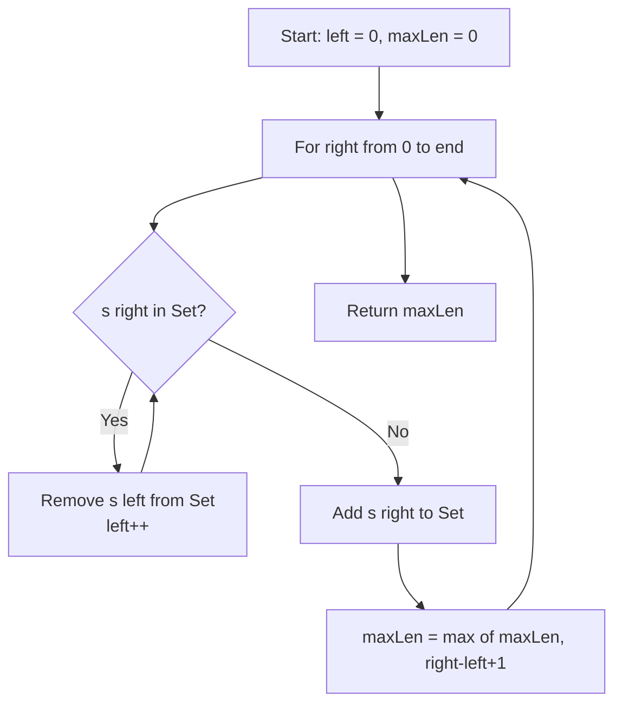

# LeetCode 3. Longest Substring Without Repeating Characters (Medium)

https://leetcode.com/problems/longest-substring-without-repeating-characters/

## U - Understand（問題の理解）

- **What**: Find the length of the longest substring with no duplicate characters
- **Input**: A string `s`
- **Output**: The length of the longest substring without repeating characters

**Clarifying Questions:**
- "Just to confirm, we need a substring, not a subsequence — the characters must be next to each other?"
- "What characters can the string contain? Just lowercase letters, or any ASCII?"
- "What should I return for an empty string?" (return 0)

**Constraints:**
- 0 <= s.length <= 5 * 10^4
- s has English letters, digits, symbols, and spaces

**Test Cases:**

1. **Happy Path**: `"abcabcbb"` → `3` (the answer is "abc")
2. **Edge Case**: `""` → `0` (empty string)
3. **Edge Case**: `"bbbbb"` → `1` (all same characters)
4. **Constraint**: `"abcd"` → `4` (all unique, answer is the whole string)
5. **Edge Case**: `"dvdf"` → `3` (the answer is "vdf", tricky overlap)

## M - Match（パターンマッチ）

**Pattern: Sliding Window with Set**

"I think we can use a sliding window with a Set to track characters in the window."

Why this pattern?
- We need the longest substring with a constraint (no duplicates).
- A sliding window works well for "longest/shortest subarray/substring" problems.
- The Set tells us if a character is already in the window in O(1).
- Both pointers only move forward — classic sliding window.

## P - Plan（プラン立て）

"Let me think about the steps."

"I keep a window [left, right]. I grow the window to the right one character at a time."

"For each new character:
1. If it is already in the Set, I shrink the window from the left. I remove characters from the Set until the duplicate is gone.
2. Then I add the new character to the Set.
3. I update maxLen with the current window size."

**Flowchart:**



**Pseudocode:**
```
// create empty Set, left = 0, maxLen = 0
// for right from 0 to end:
//   while Set has s[right]:
//     remove s[left] from Set
//     left++
//   add s[right] to Set
//   maxLen = max(maxLen, right - left + 1)
// return maxLen
```

## I - Implement（実装）

```typescript
function lengthOfLongestSubstring(s: string): number {
  const seen = new Set<string>();
  let left = 0;
  let maxLen = 0;

  for (let right = 0; right < s.length; right++) {
    // If duplicate found, shrink window from left
    while (seen.has(s[right])) {
      seen.delete(s[left]);
      left++;
    }

    seen.add(s[right]);
    maxLen = Math.max(maxLen, right - left + 1);
  }

  return maxLen;
}
```

### Alternative: Using a Map for O(n) without inner while loop

```typescript
function lengthOfLongestSubstringMap(s: string): number {
  const lastIndex = new Map<string, number>();
  let left = 0;
  let maxLen = 0;

  for (let right = 0; right < s.length; right++) {
    if (lastIndex.has(s[right]) && lastIndex.get(s[right])! >= left) {
      // Jump left directly past the previous occurrence
      left = lastIndex.get(s[right])! + 1;
    }

    lastIndex.set(s[right], right);
    maxLen = Math.max(maxLen, right - left + 1);
  }

  return maxLen;
}
```

## R - Review（振り返り）

"Let me walk through Test Case 1: `s = 'abcabcbb'`."

| Step | right | char | Duplicate? | Action | Window | Set | maxLen |
|------|-------|------|-----------|--------|--------|-----|--------|
| 1 | 0 | a | No | add 'a' | [a] | {a} | **1** |
| 2 | 1 | b | No | add 'b' | [a,b] | {a,b} | **2** |
| 3 | 2 | c | No | add 'c' | [a,b,c] | {a,b,c} | **3** |
| 4 | 3 | a | Yes | remove 'a', left=1 | [b,c,a] | {b,c,a} | 3 |
| 5 | 4 | b | Yes | remove 'b', left=2 | [c,a,b] | {c,a,b} | 3 |
| 6 | 5 | c | Yes | remove 'c', left=3 | [a,b,c] | {a,b,c} | 3 |
| 7 | 6 | b | Yes | remove 'a','b', left=5 | [c,b] | {c,b} | 3 |
| 8 | 7 | b | Yes | remove 'c','b', left=7 | [b] | {b} | 3 |

**Answer: 3** ("abc") ✓

"Let me also check Test Case 3: `s = 'bbbbb'`."

| Step | right | char | Duplicate? | Action | Window | maxLen |
|------|-------|------|-----------|--------|--------|--------|
| 1 | 0 | b | No | add 'b' | [b] | **1** |
| 2 | 1 | b | Yes | remove 'b', left=1, add 'b' | [b] | 1 |
| 3 | 2 | b | Yes | remove 'b', left=2, add 'b' | [b] | 1 |
| 4 | 3 | b | Yes | remove 'b', left=3, add 'b' | [b] | 1 |
| 5 | 4 | b | Yes | remove 'b', left=4, add 'b' | [b] | 1 |

**Answer: 1** ✓

"And the empty string `''`."
- right starts at 0. Loop condition `0 < 0` is false. Skip loop. Return 0. ✓

"And the tricky case `'dvdf'`."

| Step | right | char | Duplicate? | Action | Window | maxLen |
|------|-------|------|-----------|--------|--------|--------|
| 1 | 0 | d | No | add 'd' | [d] | **1** |
| 2 | 1 | v | No | add 'v' | [d,v] | **2** |
| 3 | 2 | d | Yes | remove 'd', left=1, add 'd' | [v,d] | 2 |
| 4 | 3 | f | No | add 'f' | [v,d,f] | **3** |

**Answer: 3** ("vdf") ✓

```typescript
console.log(lengthOfLongestSubstring("abcabcbb") === 3,  "Test 1: abc");
console.log(lengthOfLongestSubstring("bbbbb") === 1,     "Test 2: all same");
console.log(lengthOfLongestSubstring("pwwkew") === 3,    "Test 3: wke");
console.log(lengthOfLongestSubstring("") === 0,           "Test 4: empty");
console.log(lengthOfLongestSubstring("a") === 1,          "Test 5: single char");
console.log(lengthOfLongestSubstring("abcd") === 4,       "Test 6: all unique");
console.log(lengthOfLongestSubstring(" ") === 1,          "Test 7: space");
console.log(lengthOfLongestSubstring("dvdf") === 3,       "Test 8: vdf");
console.log(lengthOfLongestSubstring("abba") === 2,       "Test 9: ab or ba");
```

## E - Evaluate（評価）

### Set Approach

**Time: O(n)**
- "Each character is added to the Set once and removed at most once. So both pointers together go through the string at most 2n times — still O(n)."

**Space: O(min(n, m))** where m is the size of the character set
- "The Set stores at most min(n, 128) characters for ASCII, or min(n, 26) for lowercase letters only."

### Map Approach

**Time: O(n)**
- "Single pass. No inner while loop — we jump left directly."

**Space: O(min(n, m))**
- "Same as Set approach."

**Why this approach?**
- Brute force checks every substring — that is O(n cubed) or O(n squared) with a Set.
- Sliding window does it in O(n) with one pass.
- Set approach is easier to understand. Map approach is a bit faster.

**Trade-off:**
| | Set | Map |
|---|---|---|
| Time | O(n) (up to 2n ops) | O(n) (exactly n ops) |
| Space | O(min(n, m)) | O(min(n, m)) |
| Simplicity | Easier to write | A bit more code |

"Both work in an interview. I prefer Set because it is simpler to explain."

## VARIATIONS

### A. Set vs Map — how the window shrinks

**Set approach**: Remove characters one by one from left until the duplicate is gone (while loop).

```typescript
while (seen.has(s[right])) {
  seen.delete(s[left]);
  left++;
}
```

**Map approach**: Record where each character was last seen. Jump left in one step.

```typescript
if (lastIndex.has(s[right]) && lastIndex.get(s[right])! >= left) {
  left = lastIndex.get(s[right])! + 1;
}
```

Map is faster by a constant factor, but both are O(n). Either is fine in an interview.

### B. Return the actual substring (not just length)

```typescript
function longestSubstring(s: string): string {
  const seen = new Set<string>();
  let left = 0;
  let start = 0;
  let maxLen = 0;

  for (let right = 0; right < s.length; right++) {
    while (seen.has(s[right])) {
      seen.delete(s[left]);
      left++;
    }
    seen.add(s[right]);
    if (right - left + 1 > maxLen) {
      maxLen = right - left + 1;
      start = left;
    }
  }

  return s.slice(start, start + maxLen);
}
```

## WHEN TO USE WHICH

**Q: When should I think "sliding window with Set/Map"?**
A: When the problem asks for a longest/shortest subarray or substring with a constraint on unique elements or character frequency.

**Q: How is this different from the stock problem's sliding window?**
A: In the stock problem, the window only shrinks by jumping left to right. Here, we may need to shrink one step at a time (Set) or jump (Map). The stock problem tracks a single value (min price), while this problem tracks a set of characters.

**Q: Set vs Map — when to use which?**
A: Use Set when you only care about "is this character in the window?" Use Map when you need to know "where was this character last seen?" — the Map lets you skip the inner while loop.

## COMMON INTERVIEW QUESTIONS

**Q: Why does each character enter and leave the Set at most once?**
A: "The left pointer only moves right, never left. Each character is added when right reaches it and removed when left passes it. So each character has at most one add and one delete — total 2n operations."

**Q: Can you solve this without a Set?**
A: "Yes, I could use an array of size 128 (for ASCII) as a frequency map. The logic is the same, but array access is faster than Set operations."

**Q: What if we need the longest substring with at most K distinct characters?**
A: "Similar sliding window, but instead of a Set, I'd use a Map to count character frequencies. I shrink the window when the Map size goes over K. That's LeetCode 340."

## RELATED PROBLEMS

- LeetCode 340: Longest Substring with At Most K Distinct Characters (Medium)
- LeetCode 76: Minimum Window Substring (Hard)
- LeetCode 438: Find All Anagrams in a String (Medium)
- LeetCode 567: Permutation in String (Medium)
- LeetCode 209: Minimum Size Subarray Sum (Medium)
- LeetCode 424: Longest Repeating Character Replacement (Medium)

## HOW TO READ CODE ALOUD

**Code Symbols:**
- `new Set<string>()` → "a new Set of strings"
- `seen.has(s[right])` → "seen has the character at right"
- `seen.delete(s[left])` → "delete the character at left from seen"
- `right - left + 1` → "right minus left plus one" (window size)

**Complexity:**
- O(n) → "O of n" or "linear time"
- O(min(n, m)) → "O of min n m"

**Example Explanation Script:**
"Let me trace through 'abcabcbb'.
I start with an empty Set and both pointers at 0.
I add 'a', 'b', 'c' — no duplicates, window grows to size 3.
At index 3, I see 'a' again — it's already in the Set.
So I remove characters from the left: remove 'a', move left to 1.
Now the window is 'bca', still size 3.
I continue this process. The maximum window size I see is 3.
So the answer is 3."
