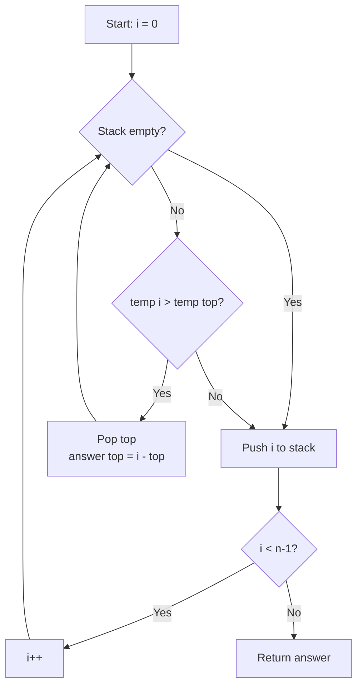

# LeetCode 739. Daily Temperatures (Medium)

https://leetcode.com/problems/daily-temperatures/

## U - Understand（問題の理解）

- **What**: For each day, find how many days until a warmer temperature
- **Input**: An array `temperatures` where `temperatures[i]` is the temperature on day `i`
- **Output**: An array where `answer[i]` is the number of days to wait for a warmer day. If no warmer day exists, `answer[i] = 0`

**Clarifying Questions:**
- "Should I count the current day itself?" (No -- only future days)
- "Does it need to be strictly warmer, or the same temperature?" (Strictly warmer)
- "What if no warmer day exists?" (Return 0 for that day)

**Constraints:**
- 1 <= temperatures.length <= 10^5
- 30 <= temperatures[i] <= 100

**Test Cases:**

1. **Happy Path**: `[73, 74, 75, 71, 69, 72, 76, 73]` → `[1, 1, 4, 2, 1, 1, 0, 0]`
2. **Edge Case**: `[50]` → `[0]` (single day, no future)
3. **Edge Case**: `[50, 50, 50]` → `[0, 0, 0]` (same is NOT warmer)
4. **Constraint**: `[50, 40, 30]` → `[0, 0, 0]` (always decreasing, no warmer day)
5. **Constraint**: `[30, 40, 50, 60]` → `[1, 1, 1, 0]` (always increasing)

## M - Match（パターンマッチ）

**Pattern: Monotonic decreasing stack**

"I think we can use a monotonic stack here."

Why?
- Brute force: for each day, check every future day → O(n^2).
- The key question is: "for each element, find the next greater element." This is the classic monotonic stack pattern.
- The stack stores indices of days we haven't found a warmer day for yet.
- When we find a warmer day, we pop and calculate the difference in indices.

## P - Plan（プラン立て）

"Let me think about the steps."

"I go through the temperatures from left to right.
1. For each new temperature, I check: is it warmer than the temperature at the top of the stack?
2. If yes, I pop the stack. The current day is the answer for that popped day. I compute the difference in indices.
3. I keep popping while the current temperature is warmer.
4. Then I push the current index onto the stack.
5. At the end, anything left in the stack means no warmer day → answer stays 0."

**Pseudocode:**
```
// create answer array filled with 0
// create empty stack (stores indices)
// for i = 0 to n-1:
//   while stack is not empty AND temp[i] > temp[top of stack]:
//     prevDay = stack.pop()
//     answer[prevDay] = i - prevDay
//   stack.push(i)
// return answer
```

**Flowchart:**



## I - Implement（実装）

```typescript
function dailyTemperatures(temperatures: number[]): number[] {
  const answer = new Array(temperatures.length).fill(0);
  const stack: number[] = []; // stores indices

  for (let i = 0; i < temperatures.length; i++) {
    // While current temp is warmer than the temp at top of stack
    while (stack.length > 0 && temperatures[i] > temperatures[stack[stack.length - 1]]) {
      const prevDay = stack.pop()!;
      answer[prevDay] = i - prevDay;
    }

    stack.push(i);
  }

  return answer;
}
```

### Why is the stack monotonic decreasing?

We only push onto the stack when the current temperature is NOT warmer than the top. So temperatures on the stack always go from bottom (warmest) to top (coolest). When a warmer day comes, it pops off all cooler days.

## R - Review（振り返り）

"Let me walk through Test Case 1: `[73, 74, 75, 71, 69, 72, 76, 73]`."

```
Temperature chart:

76|                          *
75|        *
74|     *
73|  *                             *
72|                    *
71|           *
70|
69|              *
  +--+--+--+--+--+--+--+--+
    0  1  2  3  4  5  6  7
```

**Input: [73, 74, 75, 71, 69, 72, 76, 73]**

| Step | i | temp | Action | Stack (top→) | answer |
|------|---|------|--------|-------------|--------|
| 1 | 0 | 73 | push 0 | `[0]` | [0,0,0,0,0,0,0,0] |
| 2 | 1 | 74 | 74>73 → pop 0, ans[0]=1 | `[]` | [**1**,0,0,0,0,0,0,0] |
| | | | push 1 | `[1]` | |
| 3 | 2 | 75 | 75>74 → pop 1, ans[1]=1 | `[]` | [1,**1**,0,0,0,0,0,0] |
| | | | push 2 | `[2]` | |
| 4 | 3 | 71 | 71<75 → push 3 | `[2,3]` | no change |
| 5 | 4 | 69 | 69<71 → push 4 | `[2,3,4]` | no change |
| 6 | 5 | 72 | 72>69 → pop 4, ans[4]=1 | `[2,3]` | [1,1,0,0,**1**,0,0,0] |
| | | | 72>71 → pop 3, ans[3]=2 | `[2]` | [1,1,0,**2**,1,0,0,0] |
| | | | 72<75 → push 5 | `[2,5]` | |
| 7 | 6 | 76 | 76>72 → pop 5, ans[5]=1 | `[2]` | [1,1,0,2,1,**1**,0,0] |
| | | | 76>75 → pop 2, ans[2]=4 | `[]` | [1,1,**4**,2,1,1,0,0] |
| | | | push 6 | `[6]` | |
| 8 | 7 | 73 | 73<76 → push 7 | `[6,7]` | no change |

**Result: [1, 1, 4, 2, 1, 1, 0, 0]** ✓

"Let me check the other cases too."

**Always increasing** `[30, 40, 50, 60]`:

| i | temp | Action | Stack (top→) | answer |
|---|------|--------|-------------|--------|
| 0 | 30 | push 0 | `[0]` | [0,0,0,0] |
| 1 | 40 | 40>30 → pop 0, ans[0]=1, push 1 | `[1]` | [**1**,0,0,0] |
| 2 | 50 | 50>40 → pop 1, ans[1]=1, push 2 | `[2]` | [1,**1**,0,0] |
| 3 | 60 | 60>50 → pop 2, ans[2]=1, push 3 | `[3]` | [1,1,**1**,0] |

Stack has [3] left → ans[3]=0. **Result: [1, 1, 1, 0]** ✓

**Always decreasing** `[30, 20, 10]`:

| i | temp | Action | Stack (top→) | answer |
|---|------|--------|-------------|--------|
| 0 | 30 | push 0 | `[0]` | [0,0,0] |
| 1 | 20 | 20<30 → push 1 | `[0,1]` | no change |
| 2 | 10 | 10<20 → push 2 | `[0,1,2]` | no change |

Everything stays in the stack → all 0. **Result: [0, 0, 0]** ✓

- **Single day** `[50]`: push 0, loop ends, stack=[0] → answer=[0] ✓
- **All same** `[50, 50, 50]`: 50 is NOT greater than 50, so nothing gets popped → answer=[0,0,0] ✓

```typescript
console.log(JSON.stringify(dailyTemperatures([73,74,75,71,69,72,76,73])) === JSON.stringify([1,1,4,2,1,1,0,0]),  "Test 1: mixed");
console.log(JSON.stringify(dailyTemperatures([30,40,50,60])) === JSON.stringify([1,1,1,0]),                       "Test 2: increasing");
console.log(JSON.stringify(dailyTemperatures([30,20,10])) === JSON.stringify([0,0,0]),                             "Test 3: decreasing");
console.log(JSON.stringify(dailyTemperatures([50])) === JSON.stringify([0]),                                        "Test 4: single");
console.log(JSON.stringify(dailyTemperatures([50,50,50])) === JSON.stringify([0,0,0]),                             "Test 5: all same");
console.log(JSON.stringify(dailyTemperatures([50,40,30,60])) === JSON.stringify([3,2,1,0]),                        "Test 6: warm at end");
```

## E - Evaluate（評価）

**Time: O(n)**
- "Time is O(n) because each index is pushed once and popped at most once. Even though there's a while loop inside the for loop, the total pops across all steps is at most n. So it's 2n total operations -- O(n)."

**Space: O(n)**
- "Space is O(n) for the stack in the worst case. For example, when temperatures are always decreasing like [100, 99, 98, ...], everything stays in the stack."

**Why this approach?**
- Brute force is O(n^2): two nested loops.
- Monotonic stack brings it down to O(n) by processing each element at most twice (push + pop).
- The key idea: instead of looking forward from each day, I let each day "wait" on the stack until a warmer day comes and resolves it.

**Trade-off:**
| | Brute Force | Monotonic Stack |
|---|---|---|
| Time | O(n^2) | O(n) |
| Space | O(1) extra | O(n) |
| Code | Simple | A bit more complex |

→ "Monotonic stack is better because O(n) time is much faster for large inputs."

## VARIATIONS

### A. Next Greater Element (LeetCode 496)

Same pattern but with two different arrays and a circular relationship.

### B. Monotonic Stack -- Increasing vs Decreasing

```
Decreasing stack (this problem):
  Stack keeps indices where temp decreases from bottom to top.
  Use when finding "next greater element".

  stack: [76, 72, 69]  (bottom to top: big → small)
         When 73 comes, pop 69 → 73 is the answer for 69's day

Increasing stack:
  Stack keeps indices where values increase from bottom to top.
  Use when finding "next smaller element".
```

## WHEN TO USE WHICH

**Q: When should I think "monotonic stack"?**
A: When the problem asks "for each element, find the next greater/smaller element". The keywords are "next", "greater", "smaller", "waiting for".

**Q: How is this different from a regular stack problem like Valid Parentheses?**
A: Valid Parentheses uses the stack for matching pairs. Monotonic stack uses the stack to keep an order -- elements are always sorted. The "pop" operation gives you the answer.

**Q: Brute force vs stack -- when to upgrade?**
A: If you find yourself writing two nested loops where the inner loop searches forward for a condition, that's often a monotonic stack opportunity.

## COMMON INTERVIEW QUESTIONS

**Q: Why store indices instead of temperatures?**
A: "I need to find the number of days between two events. If I stored temperatures, I'd lose track of when they happened. Indices let me compute `i - prevDay` directly."

**Q: Why is this O(n) and not O(n^2)?**
A: "Each index is pushed once and popped at most once. Even though there's a while loop inside the for loop, the total number of pops across all steps is at most n. So it's 2n total operations -- O(n)."

**Q: What if we need to find the next cooler day instead?**
A: "I'd use a monotonic increasing stack instead. Same logic, but I pop when the current temperature is lower than the stack top."

## RELATED PROBLEMS

- LeetCode 496: Next Greater Element I (Easy) -- Same monotonic stack pattern
- LeetCode 503: Next Greater Element II (Medium) -- Circular array variant
- LeetCode 84: Largest Rectangle in Histogram (Hard) -- Classic monotonic stack
- LeetCode 42: Trapping Rain Water (Hard) -- Can be solved with monotonic stack
- LeetCode 901: Online Stock Span (Medium) -- Monotonic stack for counting

## HOW TO READ CODE ALOUD

**Code Symbols:**
- `stack[stack.length - 1]` → "the top of the stack" or "stack at stack dot length minus one"
- `stack.pop()!` → "pop from the stack" (the `!` is "non-null assertion")
- `temperatures[i] > temperatures[stack[stack.length - 1]]` → "the current temperature is greater than the temperature at the index on top of the stack"
- `new Array(n).fill(0)` → "a new array of size n filled with zeros"

**Complexity:**
- O(n) → "O of n" or "linear time"

**Example Explanation Script:**
"Let me walk through [73, 74, 75, 71, 69, 72, 76, 73].
I start with an empty stack. Day 0 is 73 degrees, I push index 0.
Day 1 is 74. That's warmer than 73, so I pop index 0. The wait is 1 minus 0 equals 1 day. I push index 1.
Day 2 is 75, warmer than 74, pop index 1, wait is 1 day. Push index 2.
Day 3 is 71, cooler than 75, so I just push. Stack is now [2, 3].
Day 4 is 69, cooler, push. Stack is [2, 3, 4].
Day 5 is 72. That's warmer than 69, pop index 4, wait is 1 day. Also warmer than 71, pop index 3, wait is 2 days. But 72 is cooler than 75, so I stop and push. Stack is [2, 5].
Day 6 is 76, warmer than everything on the stack. Pop 5, wait 1 day. Pop 2, wait 4 days. Push 6.
Day 7 is 73, cooler than 76. Push. Stack is [6, 7].
Remaining indices get 0. The answer is [1,1,4,2,1,1,0,0]."
