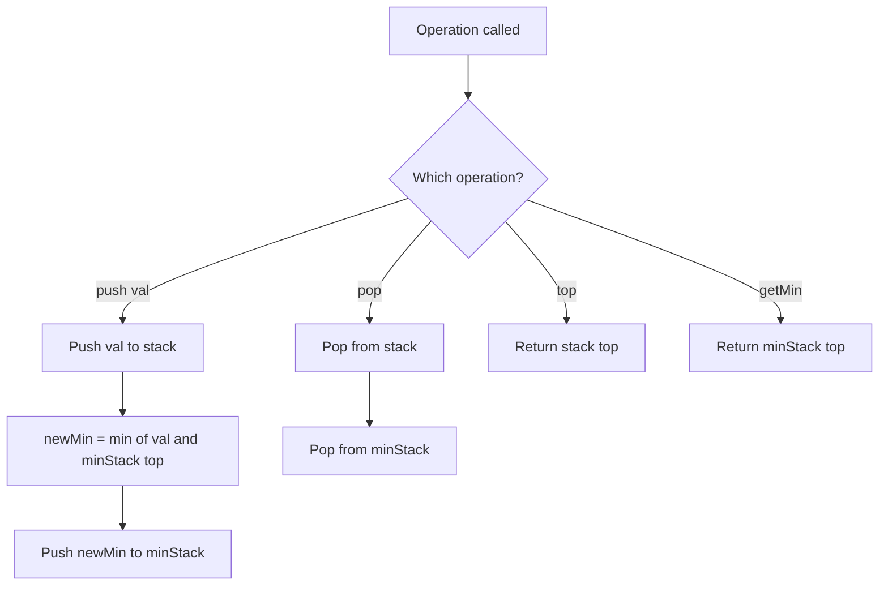

# LeetCode 155. Min Stack (Medium)

https://leetcode.com/problems/min-stack/

## U - Understand（問題の理解）

- **What**: Design a stack that supports push, pop, top, and getting the minimum element -- all in O(1) time
- **Input**: A sequence of operations (push, pop, top, getMin)
- **Output**: Results of top() and getMin() calls

**Clarifying Questions:**
- "Can I assume pop, top, and getMin will only be called on non-empty stacks?"
- "Is there a constraint on the range of values that can be pushed?"
- "Should I handle concurrent access, or is single-threaded fine?"

**Constraints:**
- -2^31 <= val <= 2^31 - 1
- pop, top, getMin are always called on non-empty stacks
- At most 3 * 10^4 calls

**Test Cases:**

1. **Happy Path**: push(-2), push(0), push(-3), getMin() → -3, pop(), top() → 0, getMin() → -2
2. **Edge Case**: push(5), getMin() → 5, top() → 5 (single element)
3. **Constraint**: push(3), push(3), push(3), getMin() → 3, pop(), getMin() → 3 (all same values)
4. **Edge Case**: push(3), push(2), push(1), pop(), getMin() → 2 (decreasing order, then pop)

## M - Match（パターンマッチ）

**Pattern: Two stacks (auxiliary data structure)**

"I think we can use two stacks to solve this."

Why?
- A regular stack gives O(1) push/pop/top. But getMin is O(n) because we have to scan the whole stack.
- The trick: record the minimum at the time of each push. When we pop, the previous minimum is already stored underneath.
- A second stack (min stack) tracks the running minimum at every level.

## P - Plan（プラン立て）

"Let me think about how to keep track of the minimum."

"If I only keep one variable for the min, when I pop that min value, I don't know what the new min is. I'd need O(n) to find it."

"So I use two stacks:
1. A main stack for the values.
2. A min stack that records the minimum at each push.

When I push a value, I also push the new minimum onto the min stack. The new minimum is either the value or the current minimum, whichever is smaller.

When I pop, I pop from both stacks. The top of the min stack always gives me the current minimum."

**Pseudocode:**
```
// class MinStack:
//   stack = []
//   minStack = []
//
//   push(val):
//     stack.push(val)
//     newMin = min(val, top of minStack) or val if minStack is empty
//     minStack.push(newMin)
//
//   pop():
//     stack.pop()
//     minStack.pop()
//
//   top():
//     return last element of stack
//
//   getMin():
//     return last element of minStack
```

**Flowchart:**



## I - Implement（実装）

```typescript
class MinStack {
  private stack: number[];
  private minStack: number[];

  constructor() {
    this.stack = [];
    this.minStack = [];
  }

  push(val: number): void {
    this.stack.push(val);
    // Push the new minimum: either val or current min, whichever is smaller
    const currentMin = this.minStack.length === 0 ? val : Math.min(val, this.minStack[this.minStack.length - 1]);
    this.minStack.push(currentMin);
  }

  pop(): void {
    this.stack.pop();
    this.minStack.pop();
  }

  top(): number {
    return this.stack[this.stack.length - 1];
  }

  getMin(): number {
    return this.minStack[this.minStack.length - 1];
  }
}
```

## R - Review（振り返り）

"Let me walk through Test Case 1: push(-2), push(0), push(-3), getMin, pop, top, getMin."

| Operation | stack | minStack | Result |
|-----------|-------|----------|--------|
| push(-2) | [-2] | [-2] | |
| push(0) | [-2, 0] | [-2, -2] | |
| push(-3) | [-2, 0, -3] | [-2, -2, **-3**] | |
| getMin() | | | **-3** |
| pop() | [-2, 0] | [-2, -2] | |
| top() | | | **0** |
| getMin() | | | **-2** |

"When we popped -3, the minStack also popped -3. The new minimum -2 was already stored underneath. No re-scanning needed."

"Let me check edge cases too."

- **Single element**: push(5) → stack=[5], minStack=[5]. getMin()=5, top()=5 ✓
- **All same values**: push(3), push(3), push(3) → minStack=[3,3,3]. getMin always 3. After pop, still 3 ✓
- **Decreasing order**: push(3), push(2), push(1) → minStack=[3,2,1]. Pop → minStack=[3,2]. getMin()=2 ✓
- **Increasing order**: push(1), push(2), push(3) → minStack=[1,1,1]. getMin always 1 ✓

```typescript
const minStack = new MinStack();
minStack.push(-2);
minStack.push(0);
minStack.push(-3);
console.log(minStack.getMin() === -3, "Test 1: getMin → -3");
minStack.pop();
console.log(minStack.top() === 0, "Test 2: top → 0");
console.log(minStack.getMin() === -2, "Test 3: getMin → -2");

// Additional tests
const ms2 = new MinStack();
ms2.push(1);
ms2.push(1);
ms2.push(1);
console.log(ms2.getMin() === 1, "Test 4: all same values → 1");
ms2.pop();
console.log(ms2.getMin() === 1, "Test 5: after pop, still → 1");

const ms3 = new MinStack();
ms3.push(3);
ms3.push(2);
ms3.push(1);
console.log(ms3.getMin() === 1, "Test 6: decreasing → 1");
ms3.pop();
console.log(ms3.getMin() === 2, "Test 7: after pop → 2");
ms3.pop();
console.log(ms3.getMin() === 3, "Test 8: after pop → 3");
```

## E - Evaluate（評価）

**Time: O(1) for all operations**
- "Every operation is constant time because I only do array push, pop, or index access."
  - push: one push to each stack → O(1)
  - pop: one pop from each stack → O(1)
  - top: array index access → O(1)
  - getMin: array index access → O(1)

**Space: O(n)**
- "I keep two stacks, each with at most n elements. So space is O(n)."

**Why this approach?**
- The naive approach for getMin is O(n) -- scan the whole stack each time.
- A single min variable breaks when we pop the min value.
- Two stacks give O(1) for all operations. The trade-off is O(n) extra space for the min stack.

**Trade-off:**
| | Two Stacks | Single min variable |
|---|---|---|
| push | O(1) | O(1) |
| pop | O(1) | O(n) to find new min |
| getMin | O(1) | O(1) |
| Space | O(n) extra | O(1) extra |

→ "Two stacks is better because all operations are O(1)."

## VARIATIONS

### A. Single Stack Approach (Space Optimization)

Instead of two stacks, store `{val, min}` pairs in one stack:

```typescript
class MinStackSingleStack {
  private stack: { val: number; min: number }[] = [];

  push(val: number): void {
    const min = this.stack.length === 0 ? val : Math.min(val, this.stack[this.stack.length - 1].min);
    this.stack.push({ val, min });
  }

  pop(): void { this.stack.pop(); }
  top(): number { return this.stack[this.stack.length - 1].val; }
  getMin(): number { return this.stack[this.stack.length - 1].min; }
}
```

Same time/space complexity, but arguably cleaner code.

### B. Optimized Min Stack (Less Space)

Only push to minStack when the new value is <= current min. Pop from minStack only when the popped value equals the current min. This saves space when few elements are minimums.

## WHEN TO USE WHICH

**Q: When should I think about using an auxiliary data structure alongside a stack?**
A: When a problem asks for O(1) access to some aggregate property (min, max, frequency) that would normally need scanning. The pattern is: keep a parallel structure that tracks the aggregate at each state.

**Q: Two stacks vs single stack with pairs?**
A: Two stacks is easier to explain in interviews and is the more common approach. Single stack with pairs is slightly more elegant. Both have the same time and space complexity.

## COMMON INTERVIEW QUESTIONS

**Q: Why can't you just keep a single variable for the minimum?**
A: "If I only track the current min in one variable, when I pop that min value, I'd need to find the new min -- which needs O(n) scanning. The min stack remembers the min at every stack level, so popping is still O(1)."

**Q: Can you optimize the space of the min stack?**
A: "Yes. I can only push to the min stack when the new value is less than or equal to the current min. And only pop from the min stack when the value being popped equals the current min. This way the min stack may be smaller than the main stack."

**Q: What if we also needed getMax in O(1)?**
A: "I'd add a third stack -- a max stack -- using the same pattern. Push the running max on each push, pop on each pop."

## RELATED PROBLEMS

- LeetCode 716: Max Stack (Hard) -- Same idea but for max, plus popMax()
- LeetCode 232: Implement Queue using Stacks (Easy) -- Stack design problem
- LeetCode 225: Implement Stack using Queues (Easy) -- Stack design problem
- LeetCode 895: Maximum Frequency Stack (Hard) -- Stack + frequency tracking

## HOW TO READ CODE ALOUD

**Code Symbols:**
- `this.stack` → "this dot stack"
- `this.minStack[this.minStack.length - 1]` → "the last element of min stack" or "the top of min stack"
- `Math.min(val, ...)` → "Math dot min of val and..."
- `push(val)` → "push val onto the stack"
- `pop()` → "pop from the stack"

**Complexity:**
- O(1) → "O of one" or "constant time"
- O(n) → "O of n" or "linear space"

**Example Explanation Script:**
"Let me walk through the example.
First, I push minus 2. Both stacks get minus 2.
Then I push 0. The main stack gets 0, but the min stack gets minus 2 again because minus 2 is still the minimum.
Next, I push minus 3. Both stacks get minus 3 since it's a new minimum.
Now getMin returns minus 3 -- just the top of the min stack.
When I pop, both stacks pop minus 3.
Top returns 0, and getMin returns minus 2 -- the previous minimum is right there on top of the min stack."
