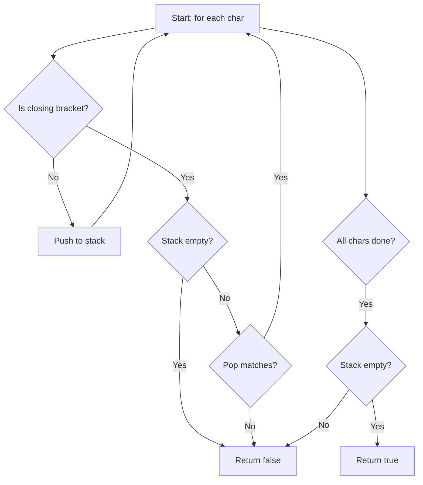

# LeetCode 20. Valid Parentheses (Easy)

https://leetcode.com/problems/valid-parentheses/

## U - Understand（問題の理解）

- **What**: Check if a string of brackets is properly matched and nested
- **Input**: String containing only '(', ')', '{', '}', '[', ']'
- **Output**: boolean - true if valid, false otherwise

**Clarifying Questions:**
- "Can the string be empty? Or is it guaranteed to have at least one character?"
- "Does the string contain only bracket characters, no other characters?"
- "Just to confirm, we need to check both matching type AND correct nesting order?"

**Constraints:**
- 1 <= s.length <= 10^4
- Only contains '()[]{}'

**Test Cases:**

1. **Happy Path**: `"{[()]}"` → `true` (nested brackets, all match)
2. **Happy Path**: `"()[]{}"` → `true` (side by side, all match)
3. **Edge Case**: `"("` → `false` (single character, unmatched)
4. **Edge Case**: `")("` → `false` (closing first, stack empty)
5. **Constraint**: `"([)]"` → `false` (wrong nesting order)

## M - Match（パターンマッチ）

**Pattern: Stack (LIFO)**

"I think we can use a stack here."

Why?
- When we see a closing bracket, we need to match it with the MOST RECENT opening bracket.
- "Most recent" is the key word. That is a LIFO pattern → Stack.
- A hash map gives us O(1) lookup to check if a pair matches.

## P - Plan（プラン立て）

"Let me think about the steps."

"I go through each character in the string.
1. If it's an opening bracket, I push it onto the stack.
2. If it's a closing bracket:
   - If the stack is empty, return false (no matching open bracket).
   - Pop from the stack and check if it matches.
   - If it doesn't match, return false.
3. After all characters, the stack should be empty."

"I'll use a hash map to map each closing bracket to its opening bracket."

**Pseudocode:**
```
// create empty stack
// create map: closing bracket → opening bracket
// for each char in string:
//   if char is a closing bracket:
//     if stack is empty OR pop doesn't match → return false
//   else:
//     push char (opening bracket) onto stack
// return stack is empty
```

**Flowchart:**



## I - Implement（実装）

```typescript
function isValid(s: string): boolean {
  const stack: string[] = [];

  // Map closing bracket to its matching opening bracket
  const pairs: Record<string, string> = {
    ")": "(",
    "]": "[",
    "}": "{",
  };

  for (const char of s) {
    if (char in pairs) {
      // It's a closing bracket
      if (stack.length === 0 || stack.pop() !== pairs[char]) {
        return false;
      }
    } else {
      // It's an opening bracket
      stack.push(char);
    }
  }

  // Stack should be empty if all brackets matched
  return stack.length === 0;
}
```

## R - Review（振り返り）

"Let me walk through Test Case 1: `{[()]}`."

| Step | char | Stack (bottom→top) | Action |
|------|------|--------------------|--------|
| 1 | { | ['{'] | Push '{' |
| 2 | [ | ['{', '['] | Push '[' |
| 3 | ( | ['{', '[', '('] | Push '(' |
| 4 | ) | ['{', '['] | ')' matches '(' ✓ Pop |
| 5 | ] | ['{'] | ']' matches '[' ✓ Pop |
| 6 | } | [] | '}' matches '{' ✓ Pop |

Stack is empty → return true ✓

"Let me also check a failing case: `([)]`."

| Step | char | Stack (bottom→top) | Action |
|------|------|--------------------|--------|
| 1 | ( | ['('] | Push '(' |
| 2 | [ | ['(', '['] | Push '[' |
| 3 | ) | - | ')' should match '[' ✗ |

Mismatch! return false ✗

"Let me check edge cases too."

- **Single character** `"("`: push '(', loop ends, stack is not empty → false ✓
- **Closing first** `")("`: stack is empty when seeing ')' → false ✓
- **Only opening** `"((("`: push 3 times, stack is not empty at end → false ✓

```typescript
console.log(isValid("()") === true, 'Test 1: "()" → true');
console.log(isValid("()[]{}") === true, 'Test 2: "()[]{}" → true');
console.log(isValid("(]") === false, 'Test 3: "(]" → false');
console.log(isValid("([])") === true, 'Test 4: "([])" → true');
console.log(isValid("{[()]}") === true, 'Test 5: "{[()]}" → true');
console.log(isValid("([)]") === false, 'Test 6: "([)]" → false');
console.log(isValid("(") === false, 'Test 7: "(" → false');
console.log(isValid(")") === false, 'Test 8: ")" → false');
console.log(isValid("((()))") === true, 'Test 9: "((()))" → true');
```

## E - Evaluate（評価）

**Time: O(n)**
- "Time is O(n) because I visit each character once. Push and pop are O(1)."

Processing "([{}])":

```
( → push         ← 1 operation
[ → push         ← 1 operation
{ → push         ← 1 operation
} → pop + check  ← 1 operation
] → pop + check  ← 1 operation
) → pop + check  ← 1 operation
─────────────────
Total: 6 = n characters
```

**Space: O(n)**
- "Space is O(n) in the worst case. If the string is all opening brackets like '(((((', I push everything onto the stack."

Worst case: "((((((("

```
( → stack: ["("]
( → stack: ["(", "("]
( → stack: ["(", "(", "("]
...
Stack has 7 items = n characters → O(n)
```

Best case: "()()()()" → stack always has at most 1 item → O(1). But we report worst case.

**Why this approach?**
- Stack is the natural fit for "most recent" matching problems.
- Hash map makes bracket matching O(1) and clean.
- Counting alone won't work with multiple bracket types. For example, `"([)]"` has equal counts but is invalid due to wrong nesting.

## VARIATIONS

- **Generate Parentheses (LeetCode 22)** - Generate all valid combinations of n pairs
- **Longest Valid Parentheses (LeetCode 32)** - Find length of longest valid substring
- **Remove Invalid Parentheses (LeetCode 301)** - Remove minimum number of invalid brackets
- **Minimum Add to Make Parentheses Valid (LeetCode 921)** - Count minimum insertions needed

## WHEN TO USE STACK

**Q: When should I think about using a Stack?**
A: Look for these patterns:
1. "Most recent" or "last opened" - matching/pairing problems
2. Nested structures - parentheses, HTML tags, function calls
3. Undo/back operations - browser history, text editor
4. Monotonic patterns - next greater element, daily temperatures
5. Expression evaluation - calculators, parsers

**Q: Stack vs Queue - when to use which?**
A: Stack (LIFO): Need to process most recent first
   Queue (FIFO): Need to process in order received

## COMMON INTERVIEW QUESTIONS

**Q: Why use a stack instead of just counting?**
A: "Counting only works for single bracket type like '()'.
With multiple types, we need to track the ORDER and TYPE
of opening brackets. Stack preserves this information.
Example: '([)]' has equal counts but is invalid due to wrong nesting."

**Q: Can you solve this without extra space?**
A: "Not really. We need O(n) space in worst case to track
unmatched opening brackets. The stack is necessary to know
which bracket was opened most recently."

**Q: What if we also had to return the position of mismatch?**
A: "I'd store the index along with the bracket in the stack,
like stack.push({char: '(', index: 0}), and return the
index when we find a mismatch."

## RELATED PROBLEMS

- LeetCode 22: Generate Parentheses (Medium)
- LeetCode 32: Longest Valid Parentheses (Hard)
- LeetCode 301: Remove Invalid Parentheses (Hard)
- LeetCode 921: Minimum Add to Make Parentheses Valid (Medium)
- LeetCode 1249: Minimum Remove to Make Valid Parentheses (Medium)
- LeetCode 1541: Minimum Insertions to Balance a Parentheses String (Medium)

## HOW TO READ CODE ALOUD

**Code Symbols:**
- `{}` → "curly braces" or "curly brackets"
- `[]` → "square brackets"
- `()` → "parentheses" (plural) or "parens" (casual)
- `stack.push()` → "stack dot push"
- `stack.pop()` → "stack dot pop"
- `stack.length === 0` → "stack dot length equals zero" or "stack is empty"
- `char in pairs` → "char in pairs" (checking if key exists)

**Complexity:**
- O(n) → "O of n" or "linear time"
- O(1) → "O of one" or "constant time"

**Example Explanation Script:**
"Let's walk through the string '([])'.
First, I see open paren, so I push it onto the stack.
Stack is now: open paren.
Next, open bracket, push it. Stack: open paren, open bracket.
Now close bracket. I pop from stack and get open bracket.
Close bracket matches open bracket, so continue.
Stack: open paren.
Finally, close paren. Pop gives open paren.
They match, and stack is empty, so return true."
