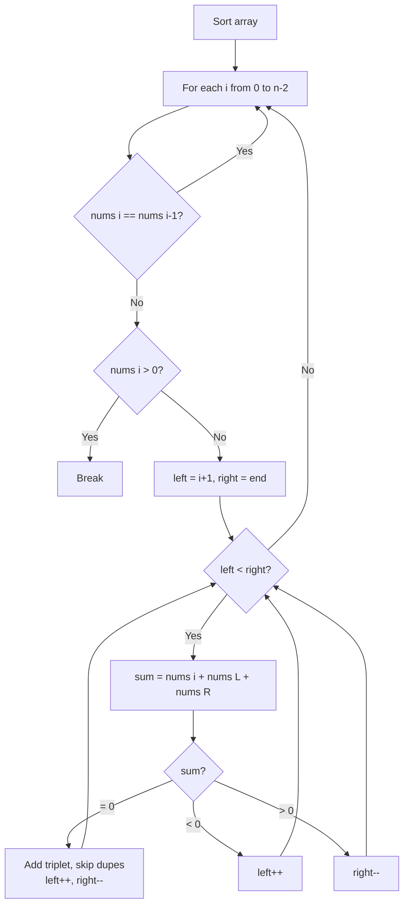

# LeetCode 15. 3Sum (Medium)

https://leetcode.com/problems/3sum/

## U - Understand（問題の理解）

- **What**: Find all unique triplets in the array that sum to zero
- **Input**: An integer array `nums`
- **Output**: All unique triplets `[nums[i], nums[j], nums[k]]` where `nums[i] + nums[j] + nums[k] == 0`

**Clarifying Questions:**
- "Can the array have duplicates?"
- "Should the result have unique triplets only?"
- "Can I change the input array by sorting it?"

**Constraints:**
- 3 <= nums.length <= 3000
- -10^5 <= nums[i] <= 10^5

**Test Cases:**

1. **Happy Path**: `[-1, 0, 1, 2, -1, -4]` → `[[-1,-1,2], [-1,0,1]]`
2. **Happy Path**: `[-2, 0, 1, 1, 2]` → `[[-2,0,2], [-2,1,1]]`
3. **Edge Case**: `[0, 0, 0]` → `[[0,0,0]]` (all same numbers)
4. **Edge Case**: `[0, 1, 1]` → `[]` (no solution)
5. **Constraint**: `[1, 2, 3]` → `[]` (all positive, no way to sum to zero)

## M - Match（パターンマッチ）

**Pattern: Sort + Fix one element + Two Pointers**

"I think we can sort the array first, then fix one element and use two pointers for the other two."

Why this pattern?
- Fixing one element turns 3Sum into a Two Sum problem.
- Sorting lets us use two pointers for Two Sum (O(n) per pass).
- Sorting also makes duplicate skipping easy — same values are next to each other.

## P - Plan（プラン立て）

"Let me think about the steps."

"First, I sort the array. Then for each element `nums[i]`, I look for two numbers that sum to `-nums[i]`. I use two pointers for that — one right after `i`, one at the end."

"To skip duplicates: if `nums[i]` is the same as the one before, I skip it. After finding a match, I also skip duplicate values for left and right pointers."

"If `nums[i] > 0`, I can stop early. Three positive numbers can't sum to zero."

**Pseudocode:**
```
// sort the array
// for each i from 0 to n-2:
//   skip if nums[i] == nums[i-1]
//   if nums[i] > 0, break
//   set left = i+1, right = end
//   while left < right:
//     sum = nums[i] + nums[left] + nums[right]
//     if sum == 0: add to result, skip duplicates, move both
//     if sum < 0: left++
//     if sum > 0: right--
// return result
```



## I - Implement（実装）

```typescript
function threeSum(nums: number[]): number[][] {
    nums.sort((a, b) => a - b);
    const result: number[][] = [];

    for (let i = 0; i < nums.length - 2; i++) {
        // Skip duplicates for the fixed element
        if (i > 0 && nums[i] === nums[i - 1]) continue;

        // Early termination: if nums[i] > 0, no valid triplet possible
        if (nums[i] > 0) break;

        let left = i + 1;
        let right = nums.length - 1;

        while (left < right) {
            const sum = nums[i] + nums[left] + nums[right];

            if (sum === 0) {
                result.push([nums[i], nums[left], nums[right]]);
                // Skip duplicates
                while (left < right && nums[left] === nums[left + 1]) left++;
                while (left < right && nums[right] === nums[right - 1]) right--;
                left++;
                right--;
            } else if (sum < 0) {
                left++;
            } else {
                right--;
            }
        }
    }

    return result;
}
```

## R - Review（振り返り）

"Let me walk through Test Case 1: `[-1, 0, 1, 2, -1, -4]`."

**Step 0: Sort**
```
[-4, -1, -1, 0, 1, 2]
```

**i=0: nums[i] = -4, target = 4**

| Step | left | right | nums[L] | nums[R] | sum | Action |
|------|------|-------|---------|---------|-----|--------|
| 1 | 1 | 5 | -1 | 2 | -3 | -3 < 0 → left++ |
| 2 | 2 | 5 | -1 | 2 | -3 | -3 < 0 → left++ |
| 3 | 3 | 5 | 0 | 2 | -2 | -2 < 0 → left++ |
| 4 | 4 | 5 | 1 | 2 | -1 | -1 < 0 → left++ |
| - | 5 | 5 | - | - | - | left >= right → done |

No triplet with -4.

**i=1: nums[i] = -1, target = 1**

| Step | left | right | nums[L] | nums[R] | sum | Action |
|------|------|-------|---------|---------|-----|--------|
| 1 | 2 | 5 | -1 | 2 | 0 | 0 === 0 ✓ → add **[-1,-1,2]** |
| 2 | 3 | 4 | 0 | 1 | 0 | 0 === 0 ✓ → add **[-1,0,1]** |
| - | 4 | 3 | - | - | - | left >= right → done |

i=2: nums[i] = -1 → same as nums[1], **skip**

**i=3: nums[i] = 0**

| Step | left | right | nums[L] | nums[R] | sum | Action |
|------|------|-------|---------|---------|-----|--------|
| 1 | 4 | 5 | 1 | 2 | 3 | 3 > 0 → right-- |
| - | 4 | 4 | - | - | - | left >= right → done |

**Result: [[-1, -1, 2], [-1, 0, 1]]** ✓

"Let me also check edge cases."
- `[0, 0, 0]` → sorted: `[0,0,0]`, i=0, left=1, right=2, sum=0 → add `[0,0,0]` ✓
- `[1, 2, 3]` → sorted: `[1,2,3]`, i=0, nums[0]=1 > 0 → break, return `[]` ✓

```typescript
console.log("Test 1:", threeSum([-1, 0, 1, 2, -1, -4]));
// Expected: [[-1,-1,2],[-1,0,1]]

console.log("Test 2:", threeSum([0, 1, 1]));
// Expected: []

console.log("Test 3:", threeSum([0, 0, 0]));
// Expected: [[0,0,0]]

console.log("Test 4:", threeSum([-2, 0, 1, 1, 2]));
// Expected: [[-2,0,2],[-2,1,1]]

console.log("Test 5:", threeSum([1, 2, 3]));
// Expected: [] (all positive, no solution)
```

## E - Evaluate（評価）

**Time: O(n^2)**
- "Sorting takes O(n log n). The outer loop runs n times. For each loop, the two-pointer scan takes O(n). So overall it's O(n^2)."

**Space: O(1)**
- "I only use a few pointer variables. The output array doesn't count."

**Why this approach?**
- Sort + Two Pointers is the standard way for 3Sum.
- Hash map approach works but handling duplicates is harder.
- "By sorting first, I can skip duplicates easily and use two pointers."

**Trade-off:**
| | Sort + Two Pointers | Hash Map |
|---|---|---|
| Time | O(n^2) | O(n^2) |
| Space | O(1) | O(n) |
| Duplicate handling | Easy (skip adjacent) | Hard |

## CORE IDEA

**3Sum = Fix one + Two Sum**

```
for each nums[i]:
    solve Two Sum with target = -nums[i]
```

Sorting gives three benefits:
1. Two pointers work (O(n) Two Sum)
2. Easy duplicate skipping (same values are next to each other)
3. Early termination (if nums[i] > 0, break)

## DUPLICATE SKIP

Duplicate skipping is the trickiest part of this problem.

**Outer skip: `if (i > 0 && nums[i] === nums[i-1]) continue`**

```
[-1, -1, 0, 1, 2]
  i=0: fix -1 → find [-1, 0, 1]
  i=1: fix -1 again → would give the same result, so skip
```

**Inner skip: `while (nums[left] === nums[left+1]) left++`**

```
[-2, 0, 0, 2, 2]
  i=0, L=1, R=4
  sum = -2 + 0 + 2 = 0 ✓
  → add [-2, 0, 2]
  left has duplicate 0 → skip
  right has duplicate 2 → skip
  → stops us from adding [-2, 0, 2] twice
```

## COMMON INTERVIEW QUESTIONS

**Q: Why do you sort the array?**
A: "Sorting lets me use two pointers and makes duplicate skipping easy. With a sorted array, 'sum too small → move left, sum too large → move right' works."

**Q: Can you use a hash map instead?**
A: "Yes, but handling duplicates is harder. Sort + two pointers is simpler and better for interviews."

**Q: Why can you break when nums[i] > 0?**
A: "The array is sorted. Everything after nums[i] is also positive. Three positive numbers can't sum to zero."

## RELATED PROBLEMS

- LeetCode 1. Two Sum (hash map approach)
- LeetCode 167. Two Sum II (sorted array, two pointers)
- LeetCode 16. 3Sum Closest
- LeetCode 18. 4Sum
