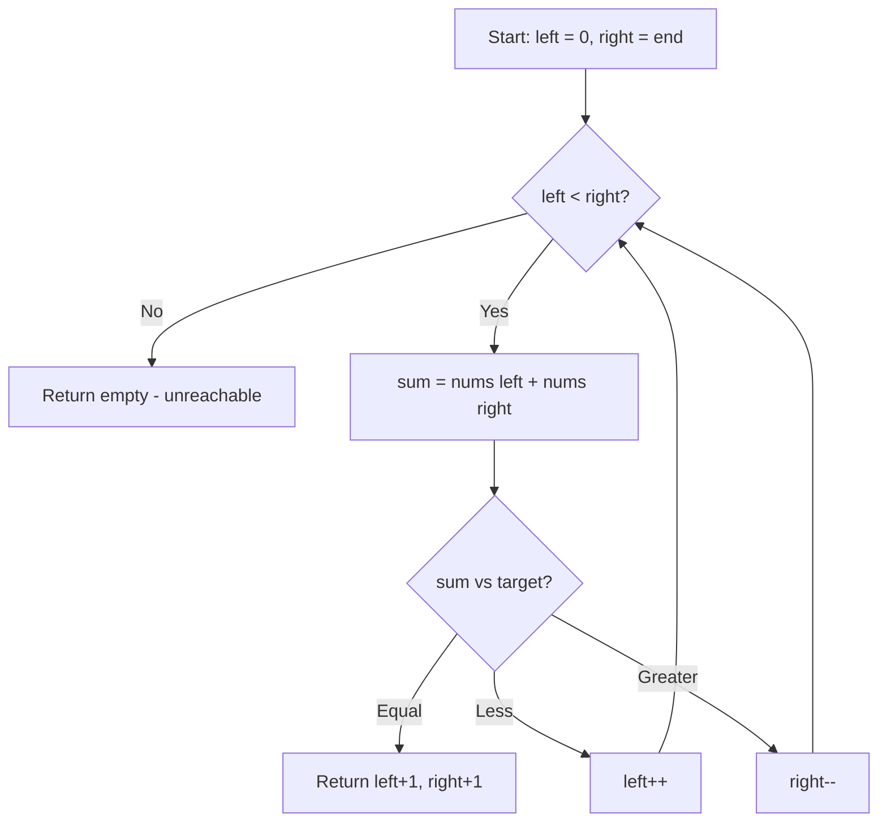

# LeetCode 167. Two Sum II - Input Array Is Sorted (Medium)

https://leetcode.com/problems/two-sum-ii-input-array-is-sorted/

## U - Understand（問題の理解）

- **What**: Find two numbers in a sorted array that add up to a target
- **Input**: A sorted integer array `numbers` and an integer `target`
- **Output**: 1-indexed positions of the two numbers as `[index1, index2]`

**Clarifying Questions:**
- "The array is already sorted, correct?"
- "Is there guaranteed to be exactly one solution?"
- "Are the indices 1-based or 0-based?"

**Constraints:**
- 2 <= numbers.length <= 3 * 10^4
- -1000 <= numbers[i] <= 1000
- Array is sorted in non-decreasing order
- Exactly one solution exists
- Must use constant extra space

**Test Cases:**

1. **Happy Path**: `numbers = [2, 7, 11, 15], target = 9` → `[1, 2]`
2. **Happy Path**: `numbers = [1, 3, 4, 5, 7, 10, 11], target = 9` → `[3, 4]` (answer in the middle)
3. **Edge Case**: `numbers = [-1, 0], target = -1` → `[1, 2]` (negative numbers)
4. **Edge Case**: `numbers = [1, 1, 3], target = 2` → `[1, 2]` (same values)
5. **Constraint**: `numbers = [1, 2, 3, 4, 5], target = 9` → `[4, 5]` (answer at the end)

## M - Match（パターンマッチ）

**Pattern: Two Pointers (from both ends)**

"I think we can use two pointers — one at the start, one at the end."

Why this pattern?
- The array is already sorted.
- If the sum is too small, move the left pointer right to make it bigger.
- If the sum is too big, move the right pointer left to make it smaller.
- This finds the answer in one pass with O(1) space.

Why not a hash map?
- Hash map works but uses O(n) space.
- The problem asks for O(1) space.
- Since the array is sorted, two pointers are simpler and faster.

## P - Plan（プラン立て）

"Let me think about the steps."

"I set left to the start, right to the end. I check the sum. If it matches the target, return the indices (plus 1 for 1-indexed). If too small, move left right. If too big, move right left."

"Since one solution is guaranteed, the pointers will always meet at the answer."

**Pseudocode:**
```
// set left = 0, right = end
// while left < right:
//   sum = numbers[left] + numbers[right]
//   if sum == target: return [left+1, right+1]
//   if sum < target: left++
//   if sum > target: right--
```



## I - Implement（実装）

```typescript
function twoSum(numbers: number[], target: number): number[] {
    let left = 0;
    let right = numbers.length - 1;

    while (left < right) {
        const sum = numbers[left] + numbers[right];

        if (sum === target) {
            return [left + 1, right + 1]; // 1-indexed
        } else if (sum < target) {
            left++;
        } else {
            right--;
        }
    }

    return []; // unreachable (exactly one solution guaranteed)
}
```

## R - Review（振り返り）

"Let me walk through Test Case 1: `numbers = [2, 7, 11, 15], target = 9`."

| Step | left | right | nums[L] | nums[R] | sum | Action |
|------|------|-------|---------|---------|-----|--------|
| 1 | 0 | 3 | 2 | 15 | 17 | 17 > 9 → right-- |
| 2 | 0 | 2 | 2 | 11 | 13 | 13 > 9 → right-- |
| 3 | 0 | 1 | 2 | 7 | 9 | 9 === 9 → return [**1, 2**] |

"Let me also walk through Test Case 2: `numbers = [1, 3, 4, 5, 7, 10, 11], target = 9`."

| Step | left | right | nums[L] | nums[R] | sum | Action |
|------|------|-------|---------|---------|-----|--------|
| 1 | 0 | 6 | 1 | 11 | 12 | 12 > 9 → right-- |
| 2 | 0 | 5 | 1 | 10 | 11 | 11 > 9 → right-- |
| 3 | 0 | 4 | 1 | 7 | 8 | 8 < 9 → left++ |
| 4 | 1 | 4 | 3 | 7 | 10 | 10 > 9 → right-- |
| 5 | 1 | 3 | 3 | 5 | 8 | 8 < 9 → left++ |
| 6 | 2 | 3 | 4 | 5 | 9 | 9 === 9 → return [**3, 4**] |

"Let me check edge cases."
- `[-1, 0], target = -1` → sum = -1 + 0 = -1 ✓ → return [1, 2] ✓
- `[1, 1, 3], target = 2` → sum = 1 + 3 = 4 > 2 → R left, sum = 1 + 1 = 2 ✓ → return [1, 2] ✓

```typescript
console.log("Test 1:", twoSum([2, 7, 11, 15], 9));
// Expected: [1, 2]

console.log("Test 2:", twoSum([2, 3, 4], 6));
// Expected: [1, 3]

console.log("Test 3:", twoSum([-1, 0], -1));
// Expected: [1, 2]

console.log("Test 4:", twoSum([1, 3, 4, 5, 7, 10, 11], 9));
// Expected: [3, 4]

console.log("Test 5:", twoSum([1, 2, 3, 4, 5], 9));
// Expected: [4, 5]
```

## E - Evaluate（評価）

**Time: O(n)**
- "Each pointer moves at most n times. I do constant work per step. So it's O(n)."

**Space: O(1)**
- "I only use two pointer variables. No matter how big the input is."

**Why this approach?**
- The array is sorted, so two pointers are perfect.
- Hash map works but uses O(n) space. The problem requires O(1) space.
- Binary search also works (O(n log n)) but two pointers is simpler and faster (O(n)).

**Trade-off:**
| | Two Pointers | Hash Map | Binary Search |
|---|---|---|---|
| Time | O(n) | O(n) | O(n log n) |
| Space | O(1) | O(n) | O(1) |
| Requirement | Sorted | Any | Sorted |

## CORE IDEA

**Two Sum II is the building block of 3Sum.**

```
3Sum:     fix one → solve Two Sum on the rest
Two Sum:  two pointers from both ends of sorted array
```

The key idea is the same:
- Sorted array → you know which way changes the sum
- Too small → move left pointer right
- Too large → move right pointer left

## WHY TWO POINTERS WORK

Think of all possible pairs as a grid:

```
        numbers[R] →
         2    7   11   15
n  2   [ 4,   9,  13,  17]
u  7   [  ,  14,  18,  22]
m 11   [  ,    ,  22,  26]
s 15   [  ,    ,    ,  30]
[L]↓
```

The grid is sorted — values get bigger going right and going down.

- Start at top-right corner (L=0, R=last)
- Too big → move left (R--)
- Too small → move down (L++)

Each step removes an entire row or column. That's why it's O(n).

## COMMON INTERVIEW QUESTIONS

**Q: Why not use a hash map like regular Two Sum?**
A: "A hash map works but uses O(n) space. The problem needs O(1) space. Since the array is sorted, two pointers do the job."

**Q: Why not use binary search?**
A: "Binary search works (O(n log n)) but two pointers is simpler and faster (O(n))."

**Q: How is this related to 3Sum?**
A: "3Sum fixes one element and runs this exact algorithm on the rest. Two Sum II is the inner loop of 3Sum."

## RELATED PROBLEMS

- LeetCode 1. Two Sum (unsorted, hash map approach)
- LeetCode 15. 3Sum (fix one + Two Sum II)
- LeetCode 16. 3Sum Closest
- LeetCode 170. Two Sum III - Data Structure Design
