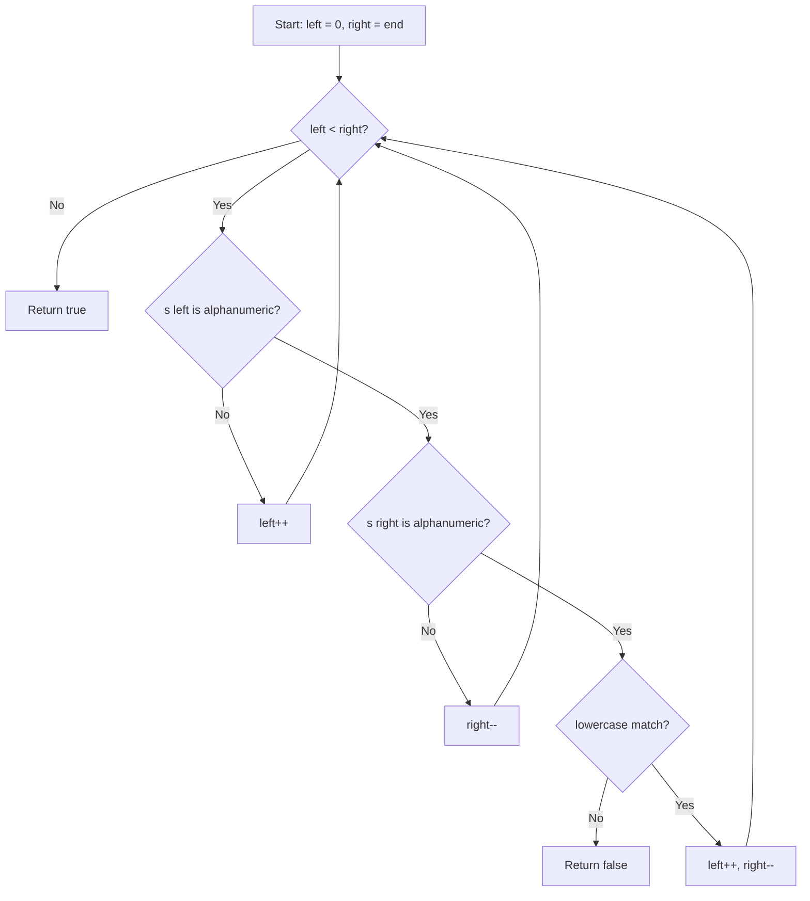

# LeetCode 125. Valid Palindrome (Easy)

https://leetcode.com/problems/valid-palindrome/

## U - Understand（問題の理解）

- **What**: Check if a string is a palindrome. Only look at letters and digits. Ignore upper/lower case.
- **Input**: A string `s` (may have letters, digits, spaces, punctuation)
- **Output**: `true` if it's a palindrome, `false` otherwise

**Clarifying Questions:**
- "When you say palindrome, should I ignore non-alphanumeric characters like spaces and punctuation?"
- "Should the comparison be case-insensitive?"
- "Is an empty string considered a palindrome?"

**Constraints:**
- 1 <= s.length <= 2 * 10^5
- s has only printable ASCII characters

**Test Cases:**

1. **Happy Path**: `"A man, a plan, a canal: Panama"` → `true` (classic palindrome with spaces and punctuation)
2. **Happy Path**: `"race a car"` → `false` (not a palindrome)
3. **Edge Case**: `" "` → `true` (empty after cleaning = palindrome)
4. **Edge Case**: `"a"` → `true` (single character)
5. **Edge Case**: `".,!"` → `true` (only symbols, empty after cleaning)
6. **Constraint**: `"0P"` → `false` (digit vs letter)
7. **Constraint**: `"Aa"` → `true` (case insensitive)

## M - Match（パターンマッチ）

**Pattern: Two Pointers (from both ends)**

"I think we can use two pointers — one from the start and one from the end."

Why this pattern?
- We need to compare characters from both ends of the string.
- Two pointers let us do this in one pass with O(1) space.
- We skip non-alphanumeric characters as we go.

Why not brute force (clean + reverse)?
- Cleaning the string first uses O(n) extra space.
- Two pointers avoid creating any new string.

## P - Plan（プラン立て）

"Let me think about the steps."

"I put one pointer at the start, one at the end. I move them inward. I skip any character that is not a letter or digit. Then I compare in lowercase. If they don't match, return false. If the pointers meet, return true."

**Pseudocode:**
```
// set left = 0, right = end of string
// while left < right:
//   skip non-alphanumeric from left
//   skip non-alphanumeric from right
//   if lowercase(s[left]) != lowercase(s[right]):
//     return false
//   left++, right--
// return true
```



## I - Implement（実装）

```typescript
function isPalindrome(s: string): boolean {
  let left = 0;
  let right = s.length - 1;

  while (left < right) {
    // Skip non-alphanumeric from left
    while (left < right && !isAlphanumeric(s[left])) {
      left++;
    }
    // Skip non-alphanumeric from right
    while (left < right && !isAlphanumeric(s[right])) {
      right--;
    }

    if (s[left].toLowerCase() !== s[right].toLowerCase()) {
      return false;
    }

    left++;
    right--;
  }

  return true;
}

function isAlphanumeric(c: string): boolean {
  return /[a-zA-Z0-9]/.test(c);
}
```

### Why not use the brute force approach?

```typescript
// Brute force — works but uses O(n) extra space
function isPalindromeBruteForce(s: string): boolean {
  const cleaned = s.replace(/[^a-zA-Z0-9]/g, "").toLowerCase();
  return cleaned === cleaned.split("").reverse().join("");
}
```

This makes a new cleaned string, a reversed copy, and joins it back. That's 3 extra strings = O(n) space. Two pointers do it in O(1) space.

## R - Review（振り返り）

"Let me walk through this with Test Case 1: `'A man, a plan, a canal: Panama'`."

| Step | left (char) | right (char) | Action | Result |
|------|-------------|--------------|--------|--------|
| 1 | 0 ('A') | 29 ('a') | 'a' == 'a' ✓ | match |
| 2 | 2 ('m') | 27 ('m') | 'm' == 'm' ✓ | match |
| 3 | 3 ('a') | 26 ('a') | 'a' == 'a' ✓ | match |
| 4 | 4 ('n') | 24 ('n') | 'n' == 'n' ✓ | match |
| ... | ... | ... | ...continues matching... | |
| - | - | - | Pointers meet | return **true** |

"Let me also check `'race a car'`."

| Step | left (char) | right (char) | Action | Result |
|------|-------------|--------------|--------|--------|
| 1 | 0 ('r') | 9 ('r') | 'r' == 'r' ✓ | match |
| 2 | 1 ('a') | 8 ('a') | 'a' == 'a' ✓ | match |
| 3 | 2 ('c') | 7 ('c') | 'c' == 'c' ✓ | match |
| 4 | 3 ('e') | 5 ('a') | 'e' != 'a' ✗ | return **false** |

"Let me check the edge case: `' '` (space only)."

```
left=0, right=0
left skips space → left=1
left(1) < right(0) is false → while loop doesn't run
return true (empty after skipping = palindrome)
```

**More edge cases verified:**
- `"a"` → left=0, right=0, left < right is false → return true ✓
- `".,!"` → both pointers skip everything, pointers cross → return true ✓
- `"0P"` → '0' != 'p' → return false ✓
- `"Aa"` → 'a' == 'a' → return true ✓

```typescript
console.log(isPalindrome("A man, a plan, a canal: Panama") === true,  "Test 1: classic palindrome");
console.log(isPalindrome("race a car") === false,                     "Test 2: not a palindrome");
console.log(isPalindrome(" ") === true,                               "Test 3: space only");
console.log(isPalindrome("a") === true,                               "Test 4: single char");
console.log(isPalindrome(".,!") === true,                             "Test 5: only symbols");
console.log(isPalindrome("0P") === false,                             "Test 6: digit vs letter");
console.log(isPalindrome("Aa") === true,                              "Test 7: case insensitive");
console.log(isPalindrome("a1b1a") === true,                           "Test 8: mixed digits and letters");
console.log(isPalindrome("ab") === false,                             "Test 9: two different chars");
```

## E - Evaluate（評価）

### Two-Pointer Approach

**Time: O(n)**
- "Each pointer goes through the string at most once, so it's linear."

**Space: O(1)**
- "I only use two pointer variables. No extra strings or arrays."

### Brute Force Approach

**Time: O(n)**
- "Cleaning, reversing, and comparing are all O(n)."

**Space: O(n)**
- "I make a cleaned string and a reversed copy."

**Why two pointers?**
- Same time as brute force, but O(1) space instead of O(n).
- "In interviews, I'd mention the brute force first, then optimize with two pointers."

**Common mistakes to watch for:**
- "I need to skip non-alphanumeric characters from both sides."
- "I must check `left < right` inside the inner while loops too, to stop the pointers from crossing."
- "I should compare in lowercase, not change the original string."

## VARIATIONS

### A. Without Helper Function (charCodeAt)

Instead of regex, use character codes for better speed:

```typescript
function isPalindromeCharCode(s: string): boolean {
  let left = 0;
  let right = s.length - 1;

  while (left < right) {
    while (left < right && !isAlnum(s.charCodeAt(left))) left++;
    while (left < right && !isAlnum(s.charCodeAt(right))) right--;

    if (toLower(s.charCodeAt(left)) !== toLower(s.charCodeAt(right))) {
      return false;
    }
    left++;
    right--;
  }
  return true;
}

function isAlnum(code: number): boolean {
  return (code >= 48 && code <= 57) ||  // 0-9
         (code >= 65 && code <= 90) ||  // A-Z
         (code >= 97 && code <= 122);   // a-z
}

function toLower(code: number): number {
  // A-Z (65-90) → a-z (97-122) by adding 32
  return (code >= 65 && code <= 90) ? code + 32 : code;
}
```

Why? Regex makes a RegExp object per call. charCodeAt is a direct number check — faster in tight loops.

### B. Recursive Approach

```typescript
function isPalindromeRecursive(s: string, left = 0, right = s.length - 1): boolean {
  while (left < right && !/[a-zA-Z0-9]/.test(s[left])) left++;
  while (left < right && !/[a-zA-Z0-9]/.test(s[right])) right--;

  if (left >= right) return true;
  if (s[left].toLowerCase() !== s[right].toLowerCase()) return false;
  return isPalindromeRecursive(s, left + 1, right - 1);
}
```

Time O(n), Space O(n) due to call stack. Not recommended — just for understanding recursion.

## WHEN TO USE WHICH

**Q: When should I use two pointers?**
A: When comparing elements from both ends of a string or array. Classic signals: "palindrome", "two sum in sorted array", "container with most water".

**Q: Brute force (clean + reverse) vs two-pointer?**
A: Both are O(n) time. Two-pointer is O(1) space vs O(n) space. In interviews, mention brute force first, then optimize.

**Q: Regex vs charCodeAt for checking alphanumeric?**
A: Regex is easier to read. charCodeAt is faster. In interviews, regex is fine. Mention charCodeAt if asked about speed.

## COMMON INTERVIEW QUESTIONS

**Q: Why two pointers instead of cleaning the string first?**
A: "Cleaning the string needs O(n) extra space. Two pointers work in-place with O(1) space. The time is the same."

**Q: What if we need to handle Unicode characters?**
A: "This solution works for ASCII. For Unicode, I'd need a better check, maybe using Unicode-aware regex like `/\p{L}|\p{N}/u`."

**Q: Can you solve this without any built-in string methods?**
A: "Yes, I'd use charCodeAt to compare character codes directly — checking ranges for 0-9, A-Z, a-z by hand."

**Q: What's the difference between this and LeetCode 680 (Valid Palindrome II)?**
A: "In 680, you can remove at most one character. When a mismatch is found, you try skipping left or right and check if either remaining part is a palindrome."

## RELATED PROBLEMS

- LeetCode 680: Valid Palindrome II (Easy) — Can remove at most one character
- LeetCode 234: Palindrome Linked List (Easy) — Two pointers on linked list
- LeetCode 9: Palindrome Number (Easy) — Check if integer is a palindrome
- LeetCode 5: Longest Palindromic Substring (Medium) — Find longest palindrome in string
- LeetCode 647: Palindromic Substrings (Medium) — Count all palindromic substrings

## HOW TO READ CODE ALOUD

**Code Symbols:**
- `s[left]` → "s at left" or "the character at index left"
- `s.length - 1` → "s dot length minus one"
- `s[left].toLowerCase()` → "s at left, converted to lowercase"
- `/[a-zA-Z0-9]/` → "a regex matching alphanumeric characters"
- `!isAlphanumeric(s[left])` → "if the character at left is not alphanumeric"

**Complexity:**
- O(n) → "O of n" or "linear time"
- O(1) → "O of one" or "constant space"

**Example Explanation Script:**
"Let me walk through the example with 'A man, a plan, a canal: Panama'.
I start with left at index 0, which is 'A', and right at the last index, which is 'a'.
Comparing lowercase, both are 'a' — they match.
I move left forward to 'm' and right backward, skipping the space, to 'm'.
They match again.
I keep going inward, skipping spaces and punctuation each time.
Eventually the pointers meet in the middle, and every pair matched — so it's a palindrome."
