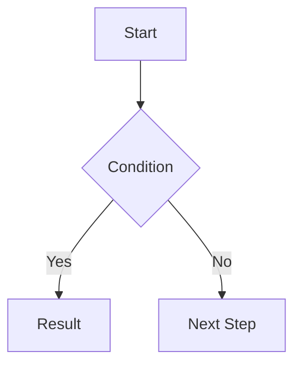

# 以下は README のテンプレート。問題の概要や解き方を README で書き記す

---

# [Problem No.] [Problem Title] (Difficulty)

## 🔗 Problem Link

[LeetCode Link Here](URL)

## 💡 Problem Summary

Given an input of ..., return ... that satisfies the condition ....

**Constraints:**

- $1 \leq n \leq 10^5$
- ...

## 🧐 Approach & Intuition

### 1. Initial Thought (Brute Force)

I initially considered iterating through all possible combinations. However, this results in a time complexity of $O(n^2)$, which would likely lead to a **Time Limit Exceeded (TLE)** given the constraint $n = 10^5$.

### 2. Optimization Strategy

To optimize the solution, I decided to use a **[Data Structure / Algorithm]** (e.g., Hash Map, Two Pointers).

- Step 1: Initialize ...
- Step 2: Iterate through the array...

